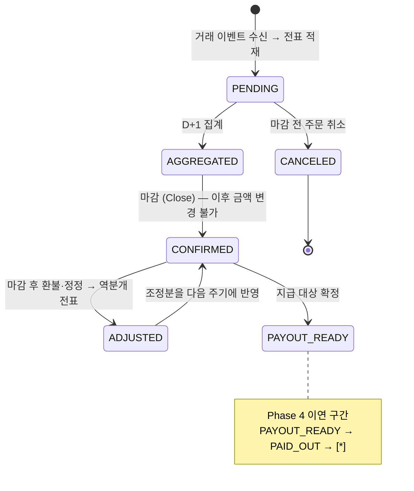
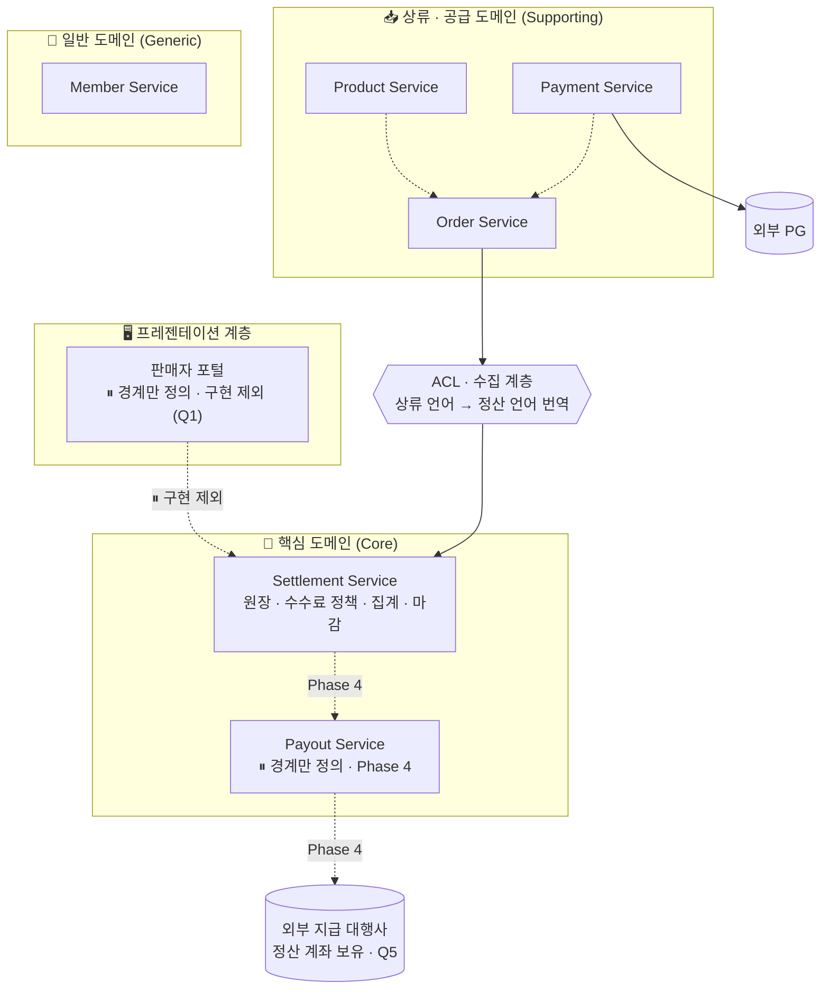
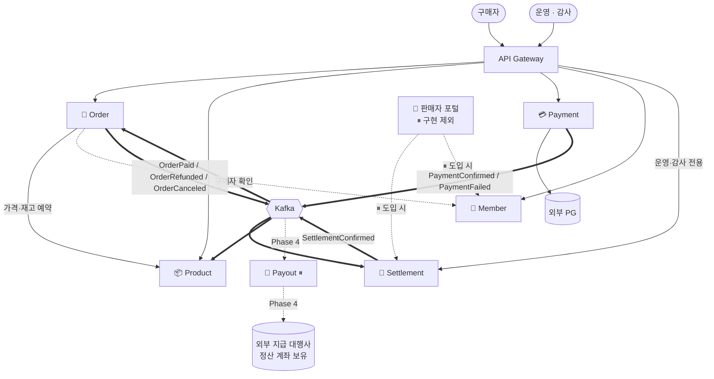
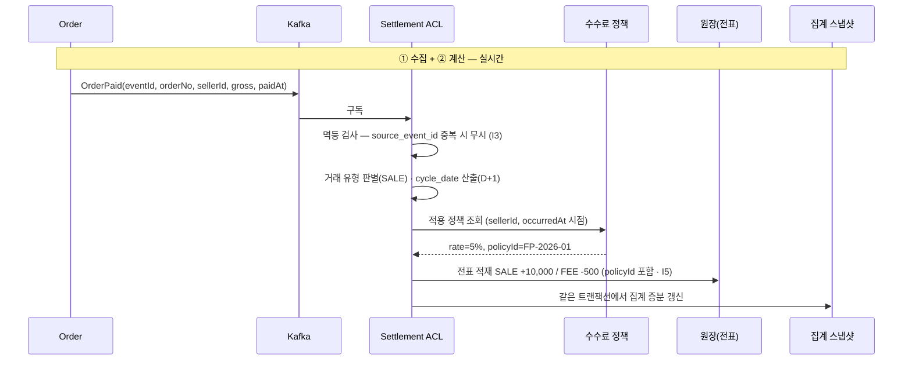
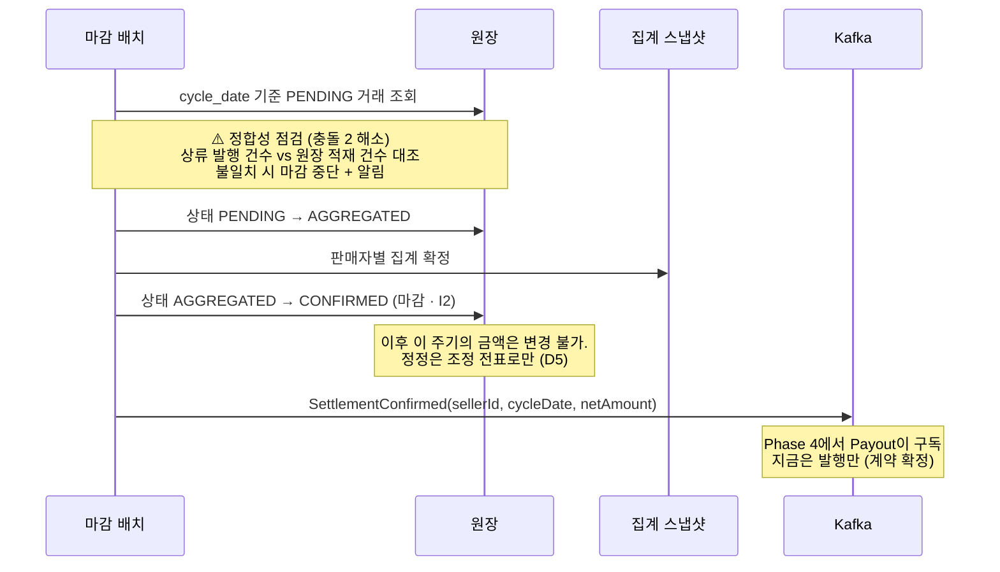

# 1주차 — 정산 도메인을 축으로 한 MSA 서비스 경계 설계

> 주문 도메인 분석에서 출발하여, **정산(Settlement)을 핵심 도메인(Core Domain)으로 놓고** 서비스 경계를 설계합니다.

| 항목 | 내용 |
|---|---|
| 과제 | 주문 도메인 기준 MSA 서비스 경계 설계 |
| 설계 축 | **정산(Settlement) 중심** |
| 기준 코드 | `com.example.demo` (Spring Boot 4.1.1 / Java 21 / PostgreSQL / Spring Batch) |
| 이번 범위 | **① 수집 → ② 계산 → ③ 집계·마감** (지급·대사는 다음 단계로 이연) |
| 문서 상태 | 🟢 설계 확정 (D1~D8 · B1~B4 · Q1~Q5) — **남은 질문 2건 + 재검토 1건**은 [13장](#13-이번-범위에서-제외한-것과-재검토-항목)에 열어둠 |
| 제약 | **1인 개발 · 4주 챌린지** — 확장 범위가 커지지 않는 선에서 설계 |

### 과제 수행 항목 대응

| 과제 요구 | 해당 장 |
|---|---|
| 주문 시스템의 주요 기능과 도메인 분석 | [2장](#2-as-is-분석--정산-관점에서-다시-읽기), [3장](#3-정산-도메인-분석) |
| 주문·상품·결제 등 기능별 책임 구분 | [4장](#4-서비스-경계-설계) |
| 각 서비스가 담당할 데이터와 역할 정의 | [4장](#4-서비스-경계-설계), [5장](#5-데이터-소유권과-정산-원장-설계) |
| 서비스 간 의존 관계를 고려한 MSA 구조 | [6장](#6-서비스-간-의존-관계), [7장](#7-핵심-시나리오) |
| 설계 내용을 실제 소스 구조에 반영 | [9장](#9-소스-구조), [10장](#10-단계별-전환-계획) |

---

## 0. 설계 결정 요약

이 문서의 모든 설계는 아래 8개 결정 위에 서 있습니다. 각 결정의 근거와 포기한 것은 [12장 ADR](#12-설계-결정-기록-adr)에 기록했습니다.

| ID | 결정 사항 | **선택** | ADR |
|---|---|---|---|
| **D1** | 정산 도메인의 내부 분할 | **2분할 — 정산 코어 / 지급** | [ADR-001](#adr-001-정산을-정산-코어와-지급으로-2분할한다) |
| **D2** | 상류 데이터 수집 방식 | **이벤트 구독 (Kafka)** | [ADR-002](#adr-002-상류-데이터는-이벤트로-수집한다) |
| **D3** | 수수료 계산 시점 | **거래 발생 시점** ⚠️ 재검토 예정 | [ADR-003](#adr-003-수수료는-거래-발생-시점에-계산해-원장에-확정한다-재검토-예정) |
| **D4** | 정산 원장 기록 모델 | **전표식 (1거래 = N개 항목)** | [ADR-004](#adr-004-정산-원장은-전표식으로-기록한다) |
| **D5** | 환불·정정 반영 방식 | **역분개 · 조정 전표** | [ADR-005](#adr-005-환불과-정정은-역분개-전표로-반영한다) |
| **D6** | 정산 주기 / 정책 소유 | **고정 D+1 / Settlement 소유** | [ADR-006](#adr-006-정산-주기는-고정-d1로-하고-정산-정책은-settlement이-소유한다) |
| **D7** | 상류 분할 수준 | **3분할 — 주문 / 결제 / 상품** | [ADR-007](#adr-007-상류를-주문·결제·상품-3개로-분할한다) |
| **D8** | 이번 설계 범위 | **범위 A — 수집·계산·집계/마감** | [ADR-008](#adr-008-이번-범위는-수집계산집계마감까지로-한다) |

### 추가 결정 — 경계 질문 답변

D1~D8 확정 이후 남아 있던 경계 질문에 대한 답입니다.

| ID | 질문 | **선택** | ADR |
|---|---|---|---|
| **B1** | 정산 조회 API를 판매자에게 직접 열 것인가 | **판매자 포털을 별도로 둔다** | [ADR-009](#adr-009-판매자-대상-조회는-별도-판매자-포털이-담당한다) |
| **B2** | Spring Batch 메타 테이블 위치 | **별도 배치 DB로 분리** | [ADR-010](#adr-010-spring-batch-메타-테이블을-별도-배치-db로-분리한다) |
| **B3** | 조정 전표 승인 절차 | **두지 않는다** | [ADR-011](#adr-011-조정-전표에-승인-절차를-두지-않는다) |
| **B4** | 판매자 정산 계좌 소유 | **이번 설계에서 구현하지 않는다** | [ADR-012](#adr-012-판매자-정산-계좌는-이번-설계에서-다루지-않는다) |

### 경계 질문 해소 (Q1~Q5)

B1~B4가 파생시킨 질문들에 대한 답입니다. **1인 개발 · 4주 챌린지라는 제약 아래 범위를 키우지 않는 방향**으로 정리됐습니다.

| ID | 질문 | **선택** | ADR |
|---|---|---|---|
| **Q1·Q2** | 판매자 포털의 형태 · 인증 주체 | **이번 범위에서 만들지 않는다.** 만든다면 최소 BFF, 인증도 그때 포털이 담당 | [ADR-013](#adr-013-판매자-포털은-이번-범위에서-구현하지-않는다) |
| **Q3** | 배치 DB의 범위 | **서비스별 배치 DB** | [ADR-014](#adr-014-배치-메타-db는-서비스별로-둔다) |
| **Q4** | 조정 전표 발행 권한 | **운영자 역할(Role) 기반 인가** | [ADR-015](#adr-015-조정-전표-발행은-운영자-역할-기반으로-제한한다) |
| **Q5** | 정산 계좌 정보의 출처 | **지급 대행사가 보유** (내부 비보유) | [ADR-016](#adr-016-정산-계좌는-지급-대행사가-보유한다) |

> ⚠️ **Q3 답변이 ADR-010의 근거를 바꿨습니다.** 배치 DB를 분리한 원래 이유가 "중앙 모니터링"이었는데, 서비스별로 두면 그 이점이 사라집니다. 근거를 다시 정리했습니다 → [ADR-010](#adr-010-spring-batch-메타-테이블을-별도-배치-db로-분리한다) · [Q6](#133-남은-경계-질문)
>
> 남아 있는 질문은 [13.3](#133-남은-경계-질문)에 2건입니다.

### ⚠️ 결정 간 충돌과 해소

두 쌍의 결정이 충돌하여, 아래와 같이 해소했습니다. **원래 결정은 그대로 유지**하고 범위·전제를 조정했습니다.

#### 충돌 1 — D1(지급 분리) ↔ D8(지급을 범위에서 제외)

지급을 별도 서비스로 두기로 했는데(D1), 이번 범위에는 지급이 없습니다(D8).

> **해소** — **경계는 지금 긋고, 구현은 이연합니다.**
> `payout-service`를 서비스 목록에 정식으로 정의하되, 이번 산출물에서는 **경계·계약(구독 이벤트, 소유 데이터)까지만** 확정하고 내부 설계와 구현은 Phase 4로 넘깁니다.
> D8의 선택 근거가 *"점진적 확장을 원했기 때문"*이므로, 경계를 미리 긋고 단계적으로 채우는 이 방식이 결정 취지에 부합합니다.
> D1에서 감수하기로 한 *"마감~지급 사이 결과적 일관성 구간"*은 **이번 범위에서는 아직 발생하지 않으며**, Phase 4 진입 시점의 리스크로 등록합니다.

#### 충돌 2 — D2(이벤트 수집) ↔ D8(대사를 범위에서 제외)

이벤트로 데이터를 받으면 유실 가능성이 생기는데, 이를 탐지할 대사(Reconciliation)가 범위 밖입니다. **이벤트 1건이 유실되면 판매자에게 그만큼 정산금이 덜 지급되고, 이를 발견할 방법이 없습니다.**

> **해소** — **Outbox를 필수 전제로 격상하고, 경량 정합성 점검을 마감 배치에 포함합니다.**
> 1. **Transactional Outbox 패턴을 선택이 아닌 필수 요건으로 확정** — 상류의 DB 커밋과 이벤트 발행을 한 트랜잭션으로 묶어 발행 단계 유실을 원천 차단합니다. ([8.2](#82-전송-보장-설계))
> 2. **마감 배치에 건수 대조 스텝 추가** — 상류가 발행한 일별 거래 건수와 원장에 적재된 건수를 비교해 불일치 시 마감을 중단합니다. ([7.1](#71-판매-거래의-정산-반영--수집--계산))
> 3. PG 입금액과 원장 합계를 대조하는 **본격 대사는 Phase 4로 이연**하고, 그때까지 이를 **미해소 리스크로 명시**합니다. ([13장](#13-이번-범위에서-제외한-것과-재검토-항목))

---

## 목차

1. [설계 원칙](#1-설계-원칙)
2. [AS-IS 분석 — 정산 관점에서 다시 읽기](#2-as-is-분석--정산-관점에서-다시-읽기)
3. [정산 도메인 분석](#3-정산-도메인-분석)
4. [서비스 경계 설계](#4-서비스-경계-설계)
5. [데이터 소유권과 정산 원장 설계](#5-데이터-소유권과-정산-원장-설계)
6. [서비스 간 의존 관계](#6-서비스-간-의존-관계)
7. [핵심 시나리오](#7-핵심-시나리오)
8. [이벤트 카탈로그](#8-이벤트-카탈로그)
9. [소스 구조](#9-소스-구조)
10. [단계별 전환 계획](#10-단계별-전환-계획)
11. [체크포인트 자가 점검](#11-체크포인트-자가-점검)
12. [설계 결정 기록 (ADR)](#12-설계-결정-기록-adr)
13. [이번 범위에서 제외한 것과 재검토 항목](#13-이번-범위에서-제외한-것과-재검토-항목)

---

## 1. 설계 원칙

경계를 가르는 기준입니다. 모든 ADR은 이 중 하나 이상에 근거합니다.

| # | 기준 | 정산 도메인에서의 의미 |
|---|---|---|
| ① | **변경 이유 (SRP)** | 수수료율·정산주기·지급수단은 서로 다른 이유로 바뀐다. 함께 바뀌지 않는 것은 함께 두지 않는다 |
| ② | **데이터 소유권** | 정산 금액의 원본은 정산이 소유한다. 상류 데이터는 복제본이며 읽기 전용이다 |
| ③ | **트랜잭션 경계** | 원장 적재와 금액 계산은 한 트랜잭션이어야 한다. 지급은 아니어도 된다 |
| ④ | **부하·확장 축** | 정산은 야간 대량 배치, 주문·결제는 주간 실시간. 자원 경쟁이 다르다 |
| ⑤ | **장애 격리** | 외부 의존(PG, 지급 대행사)이 내부 원장을 물고 넘어지면 안 된다 |
| ⑥ | **감사 가능성** | 돈을 다루므로 "왜 이 금액인가"를 언제든 재현할 수 있어야 한다. **다른 기준과 충돌하면 이 기준이 이긴다** |

### 왜 "주문 기준" 과제인데 정산이 중심인가

과제는 *"주문 도메인을 기준으로"* 경계를 설계하라고 요구합니다. 이 문서는 그것을 **"주문 도메인을 출발점으로 삼아 경계를 도출하라"**로 해석합니다. 주문 도메인을 열어본 결과가 **"주문은 정산의 입력 원천이다"**였고(근거: [2.1](#21-이-시스템은-이미-정산-시스템이다)), 따라서 경계의 중심축을 정산으로 잡았습니다.

---

## 2. AS-IS 분석 — 정산 관점에서 다시 읽기

### 2.1 이 시스템은 이미 "정산 시스템"이다

**코드 근거**

| 근거 | 위치 |
|---|---|
| 주문 생성 API의 설명이 `"정산 대상 주문 정보를 생성합니다."` | `order/controller/OrderController.java` |
| `Order` 엔티티가 정산 필드 5개 보유: `feeAmount`, `refundAmount`, `netAmount`, `settled`, `settlementBatchId` | `order/domain/Order.java` |
| `Order.markSettled(batchId, actorId)` — 정산 완료 처리 메서드가 주문 엔티티에 존재 | `order/domain/Order.java` |
| `OrderService.getSettlementCandidates(settlementDate)` — 정산 대상 조회 | `order/service/OrderServiceImpl.java` |
| 시스템의 **유일한 배치가 정산 배치** (Tasklet·Chunk 두 방식) | `batch/config/SettlementBatchConfig.java` |
| `OrderCreateRequest`가 `feeAmount`, `refundAmount`를 요청값으로 받음 | `order/dto/OrderCreateRequest.java` |

주문 도메인을 열어보면 절반이 정산 관심사입니다. **주문은 정산의 입력을 만드는 상류 도메인**이고, 이 시스템의 존재 이유는 정산입니다.

### 2.2 정산 관점에서 본 현행의 결함

단순한 "경계 흐림"이 아니라 **정산 도메인의 핵심 불변식이 깨진** 지점들입니다.

#### ⚠️ ① 확정된 정산 금액이 조용히 바뀐다 — 가장 심각

```java
// Order.java
@PreUpdate
public void onUpdate() {
    grossAmount = defaultAmount(grossAmount);
    feeAmount = defaultAmount(feeAmount);
    refundAmount = defaultAmount(refundAmount);
    netAmount = calculateAmount(grossAmount, feeAmount, refundAmount);  // ← 매 수정마다 재계산
    ...
}
```

**정산이 이미 끝난 주문이라도** 주문 행이 수정되면 정산 금액이 재계산됩니다. `settled = true`여도 막지 않습니다. 회계 기록에 반드시 있어야 할 **마감(Close)** 개념이 없습니다. (기준 ⑥ 위반)

#### ⚠️ ② 정산 이력이 남지 않는다

정산 결과가 `Order` 행의 `settled` boolean 하나로 표현되어 다음을 알 수 없습니다.

- 이 금액이 **어떤 수수료율로** 계산됐는가
- **언제** 정산됐고 **누가** 실행했는가
- 환불이 **몇 번, 각각 얼마씩** 발생했는가 (`refundAmount` 단일 필드 → 부분환불 이력 소실)
- 정정이 있었다면 **무엇을 어떻게** 고쳤는가

원장(Ledger)이 없고 플래그만 있습니다.

#### ⚠️ ③ 수수료 정책이 시스템에 존재하지 않는다

`feeAmount`를 **클라이언트가 요청 본문으로 보냅니다.** 플랫폼 수수료를 외부가 정하는 구조이며, 수수료율 테이블도 계산기도 없습니다.

#### ⚠️ ④ 정산 배치가 주문 테이블을 직접 읽는다

```java
// SettlementBatchConfig.settlementChunkReader()
List<Order> orders = orderRepository.findUnsettledPaidOrders(fromInclusive, toExclusive);
```

`batch` 패키지가 `order.domain.Order`와 `order.repository.OrderRepository`를 직접 import합니다. `OrderServiceImpl.getSettlementCandidates()`라는 서비스 메서드가 있는데도 **우회해서 리포지토리에 직접 접근**합니다. 주문 스키마가 바뀌면 정산이 깨집니다.

#### ⚠️ ⑤ 정산 상태 전이가 없다

`settled: Boolean` 하나로는 `집계됨 / 마감됨 / 보류(분쟁) / 정정됨`을 구분할 수 없습니다.

#### ⚠️ ⑥ 정산의 끝단이 비어 있다

`SettlementTasklet`은 로그만 출력하고 `// TODO : 실제 정산 집계/원장 반영 로직으로 교체` 상태입니다. 지급·대사 단계는 존재하지 않습니다.

#### ⚠️ ⑦ 결제가 주문·정산과 연결되어 있지 않다

- `Payment.orderId`는 `String`, `Order.orderNo`는 주문이 자체 생성 — 매칭 규약 없음
- `PaymentServiceImpl.confirm()`이 **주문 상태를 갱신하지 않음**
- 즉 **정산의 근거가 되는 "실제 입금 사실"과 주문이 연결되지 않습니다**

---

## 3. 정산 도메인 분석

### 3.1 유비쿼터스 언어

| 용어 | 정의 | 소유 | 현행 대응 |
|---|---|---|---|
| **정산 거래(Settlement Transaction)** | 정산 대상이 되는 개별 사건. 판매·환불·조정 | Settlement | 없음 (`Order` 행으로 대용) |
| **전표(Entry)** | 거래를 구성하는 금액 항목 한 줄. append-only | Settlement | 없음 |
| **정산 원장(Ledger)** | 전표의 집합. 정산의 **단일 진실 원천** | Settlement | 없음 |
| **총액(Gross)** | 구매자가 지불한 금액 | Order → Settlement 복제 | `Order.grossAmount` |
| **수수료(Fee)** | 플랫폼이 차감하는 금액 | Settlement | `Order.feeAmount` (외부 입력 ⚠️) |
| **환불(Refund)** | 판매 취소로 차감되는 금액 | Settlement | `Order.refundAmount` (단일 필드 ⚠️) |
| **정산 금액(Net)** | 전표 합계 (`SALE + FEE + REFUND + ADJUSTMENT`) | Settlement | `Order.netAmount` (매 수정마다 재계산 ⚠️) |
| **정산 주기(Cycle)** | 집계 단위 기간. **이번 설계에서는 D+1 고정** | Settlement | 없음 |
| **마감(Close)** | 특정 주기의 정산을 확정. **이후 금액 변경 불가** | Settlement | 없음 ⚠️ |
| **조정(Adjustment)** | 마감 후 오류·환불을 보정하는 **역분개 전표** | Settlement | 없음 |
| **수수료 정책(Fee Policy)** | 판매자·기간별 수수료율 규칙 | Settlement (D6) | 없음 |
| **지급(Payout)** | 확정 금액을 판매자 계좌로 송금 | Payout | 없음 — Phase 4 |

### 3.2 정산 거래의 생애주기

이번 범위(D8 = 범위 A)에 해당하는 상태만 표시하고, 지급 단계는 이연 구간으로 구분했습니다.



> 현행은 이 전체를 `settled: Boolean` 하나로 표현합니다. **정산 도메인의 핵심 책임은 이 상태 전이의 소유권**이며, 이것이 경계 설정의 출발점입니다.

### 3.3 정산 도메인의 불변식 (Invariants)

**설계 검증 기준입니다.** 모든 구현은 아래를 만족해야 합니다.

| # | 불변식 | 현행 | 이번 설계에서의 보장 수단 |
|---|---|---|---|
| I1 | 원장은 **추가만 가능(append-only)**, 사후 수정 불가 | ❌ | 전표식 모델(D4) + UPDATE 금지 |
| I2 | **마감된 주기의 금액은 변경 불가.** 변경은 조정 전표로만 | ❌ | 마감 상태 검증 + 역분개(D5) |
| I3 | 같은 거래는 원장에 **두 번 들어가지 않는다** | ⚠️ | `source_event_id` 유니크 제약 |
| I4 | `net` = 해당 거래의 **전표 합계**와 항상 일치 | ⚠️ | 전표 합계로만 산출, 별도 저장 금지 |
| I5 | 정산 금액은 **계산 근거(적용 수수료율·시점)를 재현** 가능 | ❌ | 전표에 `fee_policy_id` 기록(D3) |
| I6 | 지급 금액 합계 = 확정 정산 금액 합계 | — | Phase 4 |
| I7 | 정산 결과는 **상류 데이터가 바뀌어도 불변** | ❌ | 적재 시점 스냅샷 복제 |

---

## 4. 서비스 경계 설계

### 4.1 도메인 분류 (Context Map)



| 분류 | 서비스 | 성격 | 이번 범위 |
|---|---|---|---|
| **Core** | Settlement | 사업의 차별점. 정확성·감사 가능성 최우선 | ✅ **초점** |
| **Core** | Payout | 외부 송금 연동 | ⏸ 경계만 정의 |
| Supporting | Order | 정산의 유일한 입력원 | ✅ |
| Supporting | Payment | 외부 PG 연동 | ✅ |
| Supporting | Product | 상품·재고 | ✅ |
| Generic | Member | 회원 신원 (신원만 · B4) | ✅ (최소 구성) |
| 프레젠테이션 | 판매자 포털 | 판매자 대면 화면·조합 (B1) | ⏸ **구현 제외** (ADR-013) |

> **판매자 포털은 도메인 서비스가 아닙니다.** 자체 데이터를 소유하지 않고 다른 서비스의 응답을 조합할 뿐이므로, Core/Supporting/Generic 어디에도 넣지 않고 별도 계층으로 표시했습니다.
>
> **Q1 결정에 따라 이번 범위에서는 만들지 않습니다.** 그래도 경계를 그려두는 이유는, **B1의 분리 효과가 포털 없이도 이미 달성되기 때문**입니다 — Settlement은 `sellerId`에만 답하고 "그가 누구인지·권한이 있는지"를 모릅니다. 나중에 최소 BFF로 붙이면 Settlement을 수정할 필요가 없습니다.

### 4.2 서비스별 책임과 데이터

#### 🧾 Settlement Service — 핵심 도메인

- **한 줄 책임**: 거래를 **정산 원장에 기록하고 판매자 지급액을 확정**한다
- **하지 않는 일**: 거래 발생, 결제 승인, 실제 송금(Payout 소유)

| 영역 | 책임 |
|---|---|
| 수집 (ACL) | `OrderPaid` / `OrderRefunded` 이벤트를 **정산 거래로 번역**, 멱등 적재 |
| 계산 | 거래 발생 시점에 수수료 계산, 전표 생성 (D3) |
| 정책 | 수수료 정책(`fee_policy`)과 정산 정책 소유 (D6) |
| 집계·마감 | D+1 주기 집계, 마감 시 금액 불변화 |
| 조정 | 마감 후 환불·정정을 역분개 전표로 반영 (D5) · 승인 절차 없음 (B3) |
| 조회 | 정산 현황 **내부 API 제공**. 판매자 대면은 판매자 포털이 담당 (B1) |

**소유 데이터**: `settlement_transaction`, `settlement_entry`, `settlement_summary`, `fee_policy`, `settlement_cycle`
*(Spring Batch 메타 테이블은 B2 결정에 따라 별도 배치 DB — [5.3](#53-서비스별-저장소))*

**주요 API** — 모두 **내부 API**입니다. 판매자에게 직접 노출하지 않습니다 (B1). Q1 결정으로 포털을 만들지 않으므로, **이번 범위의 소비자는 운영·감사와 스케줄러뿐**입니다.

| Method | Path | 설명 | 이번 범위 소비자 | 포털 도입 시 |
|---|---|---|---|---|
| `GET` | `/api/settlements/sellers/{sellerId}` | 판매자 정산 현황 (실시간) | 운영 | + 포털 |
| `GET` | `/api/settlements/cycles/{cycleDate}` | 주기별 정산 결과 | 운영 | + 포털 |
| `GET` | `/api/settlements/transactions/{txId}/entries` | 전표 상세 (감사용 · 기준 ⑥) | 운영 · 감사 | — |
| `POST` | `/api/settlements/cycles/{cycleDate}/close` | 정산 마감 배치 실행 | 스케줄러 · 운영 | — |
| `POST` | `/api/settlements/adjustments` | 조정 전표 발행 | 운영 (**역할 인가** · Q4) | — |

> **포털이 없어도 B1의 경계 효과는 달성됩니다.** Settlement은 `sellerId`에 대한 정산 데이터만 답할 뿐, **그가 누구인지·권한이 있는지를 모릅니다.** 인증·권한 확인·화면 조합이 애초에 이 서비스에 없으므로, 나중에 포털을 붙일 때 Settlement을 수정할 필요가 없습니다 (기준 ①).
>
> ⚠️ 뒤집어 말하면 **이 API에는 소유권 검증이 없습니다.** 외부에 직접 노출하면 타 판매자의 정산액이 조회되므로, 포털이 생기기 전까지 **내부망·운영 전용**으로 제한합니다.

#### 💸 Payout Service — ⏸ 경계만 정의 (Phase 4)

D1 결정에 따라 별도 서비스로 경계를 긋되, D8 범위에 따라 **구현은 이연**합니다. 지금 확정하는 것은 **계약**뿐입니다.

| 항목 | 내용 |
|---|---|
| 한 줄 책임 | 확정된 정산 금액을 **판매자 계좌로 송금**한다 |
| 하지 않는 일 | 금액 계산, 원장 기록 |
| 구독 이벤트 | `SettlementConfirmed(sellerId, cycleDate, netAmount)` |
| 발행 이벤트 | `PayoutCompleted` / `PayoutFailed` |
| 소유 데이터 | `payout`, `payout_attempt` |
| 외부 의존 | 지급 대행사 API |
| 분리 근거 | 외부 송금 장애를 원장에서 격리 (기준 ⑤) |
| **송금 대상 계좌 정보** | **지급 대행사가 보유** (Q5 · ADR-016). 내부는 판매자 식별자만 전달 |

> **경계를 미리 긋는 이유**: Settlement이 `SettlementConfirmed` 이벤트를 **지금부터 발행**하도록 설계해두면, Phase 4에서 Settlement을 수정하지 않고 Payout만 붙일 수 있습니다.
>
> **Q5 결정으로 계약이 완결됐습니다.** 계좌 정보를 지급 대행사가 보유하므로 **Payout이 추가로 의존하는 내부 서비스가 없습니다.** Member를 호출하지 않고, 민감정보를 내부에 저장하지도 않습니다. Phase 4에서 늘어나는 간선은 외부 지급 대행사 하나뿐입니다 ([6.3](#63-순환-의존이-없음을-확인)).

#### 🛒 Order Service

- **한 줄 책임**: 주문의 **상태 전이**를 소유하고 구매 플로우를 조율한다
- **하지 않는 일**: 재고 차감, PG 호출, **수수료·정산 금액 계산**
- **정산 관점의 역할**: 정산의 **유일한 입력원**. `OrderPaid` / `OrderRefunded` 발행

**소유 데이터**: `order`, `order_item`, `order_status_history`
**이관 대상**: `feeAmount`, `refundAmount`, `netAmount`, `settled`, `settlementBatchId` → Settlement ([5.1](#51-현행-order-테이블의-컬럼-이관))

| Method | Path | 설명 |
|---|---|---|
| `POST` | `/api/orders` | 주문 생성 (금액은 서버가 Product 조회로 계산) |
| `GET` | `/api/orders/{orderNo}` | 주문 조회 |
| `POST` | `/api/orders/{orderNo}/cancel` | 주문 취소 |

#### 💳 Payment Service

- **한 줄 책임**: 외부 PG 연동과 **결제 승인 사실**을 소유한다
- **하지 않는 일**: 주문 상태 변경(이벤트로 알릴 뿐), 재고 조작, 정산 금액 계산
- **분리 근거**: 유일한 외부 시스템 의존 (기준 ⑤) + PG 스펙 변경이라는 고유 변경 이유 (기준 ①)

**소유 데이터**: `payment`, `payment_failure`
**개선 사항**: `Payment.orderId` → **`Order.orderNo` 참조로 규약화** (현행 ⑦ 결함)

#### 📦 Product Service

- **한 줄 책임**: 상품 정보와 **재고 가용성**을 소유한다
- **하지 않는 일**: 주문 상태 판단, 금액 정산
- **재고를 함께 두는 이유**: "살 수 있는가"에 함께 답하는 데이터로 강한 정합성이 필요 (기준 ③). 패키지를 `product/` `inventory/`로 선분리해 재분리 여지 확보

**소유 데이터**: `product`, `stock`, `stock_reservation`
**개선 사항**: 현행 `/api/resources` 경로 → `/api/products`로 정정

#### 👤 Member Service

- **한 줄 책임**: 회원 신원을 소유한다
- **이번 범위**: 최소 구성 — 구매자·판매자 **신원만**. **정산 계좌는 다루지 않습니다** (B4)
- **필요 이유**: 현행에서 `buyerId` / `sellerId`가 UUID로만 떠 있어 실체가 없음
- **소비자**: Order(구매자 확인), 판매자 포털(판매자 인증)

**소유 데이터**: `member`

> B4 결정으로 `seller_account`를 **설계에서 제외**했고, Q5에서 **정산 계좌를 지급 대행사가 보유**하기로 확정됐습니다 (ADR-016). 따라서 Member는 Phase 4 이후에도 계좌를 갖지 않으며, **끝까지 신원 확인만 담당하는 최소 서비스로 남습니다.**

> **판매자 정산 정책(수수료율·주기)은 Member가 아니라 Settlement이 소유합니다.** (D6 결정 — *"정산 정책도 정산이라는 카테고리에 들어가기 때문"*)

---

## 5. 데이터 소유권과 정산 원장 설계

### 5.0 데이터 소유권 규칙

| # | 규칙 | 근거 |
|---|---|---|
| R1 | **정산 금액의 원본은 Settlement이 소유한다.** 상류는 정산 금액을 보유하지 않는다 | 현행 ①②③ 결함 해소 |
| R2 | 정산은 상류 DB를 **직접 조회하지 않는다** | 현행 ④ 결함 해소 / 체크포인트 2번 |
| R3 | 상류 데이터의 복제본은 **읽기 전용**이며, 전표 적재 시점의 **스냅샷으로 고정**한다 | 불변식 I7 |
| R4 | Settlement은 어떤 상류 서비스도 **호출하지 않는다** (하류 리프) | 순환 의존 차단 |
| R5 | 상류는 Settlement의 **존재를 모른다** | 단방향 의존 |

### 5.1 현행 `order` 테이블의 컬럼 이관

| 현행 컬럼 | 이관 대상 | 사유 |
|---|---|---|
| `fee_amount` | → `settlement_entry` (FEE 전표) | 수수료 정책은 Settlement 소유 (R1) |
| `refund_amount` | → `settlement_entry` (REFUND 전표) | 부분환불 이력을 전표로 보존 |
| `net_amount` | → **저장하지 않음. 전표 합계로 산출** | 불변식 I4 — **`@PreUpdate` 자동 재계산 제거** |
| `settled` | → `settlement_transaction.status` | boolean → 상태 enum으로 확장 |
| `settlement_batch_id` | → `settlement_cycle` 연결 | 정산 진행 상태는 Settlement 관심사 |
| `gross_amount` | Order 유지 + Settlement **스냅샷 복제** | 주문서 금액이자 정산 기준 금액 (R3) |
| `paid_at` | Order 유지 + Settlement **스냅샷 복제** | 주문 상태 전이 시각이자 정산 기준일 |
| `status` | Order 유지 (`String` → `OrderStatus` enum) | 상태 전이를 타입으로 강제 |

> `Order.markSettled()` 메서드는 **삭제**하고 정산 원장의 상태 전이로 대체합니다.

### 5.2 정산 원장 스키마 (D4 = 전표식)

#### `settlement_transaction` — 정산 거래 헤더

| 컬럼 | 타입 | 설명 |
|---|---|---|
| `tx_id` | UUID | PK |
| `tx_type` | enum | `SALE` / `REFUND` / `ADJUSTMENT` |
| `ref_tx_id` | UUID | 원거래 참조 (REFUND·ADJUSTMENT일 때) |
| `order_no` | varchar | 상류 주문 참조 키 (스냅샷) |
| `seller_id` | UUID | 정산 대상 판매자 |
| `cycle_date` | date | 귀속 정산 주기 (D+1) |
| `occurred_at` | timestamp | 거래 발생 시각 (스냅샷) |
| `status` | enum | `PENDING` / `AGGREGATED` / `CONFIRMED` / `ADJUSTED` / `CANCELED` |
| `source_event_id` | varchar | **멱등키 · UNIQUE** (불변식 I3) |

#### `settlement_entry` — 전표 항목 (append-only)

| 컬럼 | 타입 | 설명 |
|---|---|---|
| `entry_id` | UUID | PK |
| `tx_id` | UUID | 소속 거래 |
| `entry_type` | enum | `SALE` / `FEE` / `VAT` / `REFUND` / `FEE_RETURN` / `ADJUSTMENT` |
| `amount` | numeric(15,2) | **부호 있는 금액** (차감은 음수) |
| `fee_policy_id` | UUID | 적용된 수수료 정책 (불변식 I5) |
| `issued_by` | varchar | 발행 주체. 자동 적재는 `SYSTEM`, 수기 조정은 운영자 식별자 |
| `created_at` | timestamp | 기록 시각 |

> **UPDATE·DELETE를 금지합니다.** 정정이 필요하면 상쇄 전표를 추가합니다 (D5).
>
> **`issued_by`를 둔 이유**: B3 결정으로 조정 전표에 승인 절차를 두지 않으므로, 발행 즉시 원장에 반영됩니다. Q4에서 **운영자 역할(Role) 기반 인가**로 호출 자격을 제한하기로 했고(ADR-015), `issued_by`가 그 위에 **"권한 있는 누가 언제 발행했는가"**를 남깁니다 (기준 ⑥). 역할 검증을 Gateway에서 할지 Settlement에서 할지는 [Q7](#133-남은-경계-질문)로 열려 있습니다.

**기록 예시** — 10,000원 판매, 수수료율 5%

```
settlement_transaction
| tx_id | tx_type | order_no | seller_id | cycle_date | status    |
| tx-01 | SALE    | ORD-001  | S-100     | 2026-01-16 | CONFIRMED |

settlement_entry
| entry_id | tx_id | entry_type | amount   | fee_policy_id |
| e-01     | tx-01 | SALE       | +10,000  | -             |
| e-02     | tx-01 | FEE        |    -500  | FP-2026-01    |   ← 적용 정책이 박힘 (I5)
                              net = +9,500  (전표 합계 · I4)
```

#### `settlement_summary` — 집계 스냅샷 (읽기 모델)

D2 결정 시 *"실시간 정산 현황 조회 = 필요"*로 답했으므로, 전표를 매번 집계하지 않도록 읽기 모델을 둡니다.

| 컬럼 | 설명 |
|---|---|
| `seller_id`, `cycle_date` | 복합 PK |
| `gross_sum`, `fee_sum`, `refund_sum`, `adjustment_sum` | 전표 유형별 합계 |
| `net_amount` | 정산 예정 금액 |
| `status` | 주기 상태 |
| `updated_at` | 갱신 시각 |

> 전표 적재 시 **같은 트랜잭션에서 증분 갱신**합니다 (기준 ③). 원본은 어디까지나 전표이며, 스냅샷이 틀리면 전표에서 재생성합니다.

#### `fee_policy` — 수수료 정책 (D6: Settlement 소유)

| 컬럼 | 설명 |
|---|---|
| `policy_id` | PK |
| `seller_id` | null이면 전체 기본 정책 |
| `rate` | 수수료율 |
| `effective_from` / `effective_to` | 적용 기간 — **거래 시점 기준으로 조회** (D3) |

### 5.3 서비스별 저장소

**Database per Service.** 조인이 아니라 API·이벤트로 데이터를 합칩니다.

| 서비스 | 스키마 | 포트 |
|---|---|---|
| gateway | — | 8080 |
| order-service | `order_db` | 8081 |
| product-service | `product_db` | 8082 |
| payment-service | `payment_db` | 8083 |
| **settlement-service** | `settlement_db` | 8084 |
| member-service | `member_db` | 8085 |
| payout-service ⏸ | `payout_db` | 8086 (Phase 4) |
| 판매자 포털 ⏸ | 자체 저장소 없음 | — (구현 제외 · ADR-013) |
| **배치 메타 (B2·Q3)** | `settlement_batch_db` | — (DB만, 서비스 전용) |

### 5.4 Spring Batch 메타 테이블 분리 (B2)

B2 결정에 따라 `BATCH_JOB_INSTANCE` / `BATCH_JOB_EXECUTION` / `BATCH_STEP_EXECUTION` 등 메타 테이블을 `settlement_db`가 아닌 **`settlement_batch_db`로 분리**하고, Q3 결정에 따라 이 DB는 **정산 서비스 전용**입니다.

**분리하는 이유** — Q3 결정으로 근거가 바뀌었습니다.

| | 근거 | Q3 이후 |
|---|---|---|
| ~~중앙 모니터링~~ | 여러 서비스 배치를 한곳에서 운영 | ❌ **무효** — 서비스별로 두므로 해당 없음 |
| 관심사 분리 | 배치 실행 이력은 **운영 데이터이지 정산 데이터가 아님**. 백업·보존 주기를 다르게 가져갈 수 있음 | ✅ 유효 |
| 승격 여지 | 나중에 전사 공용으로 통합할 때 접속 정보만 변경 | ✅ 유효 |

> ⚠️ **근거가 "관심사 분리"뿐이라면, 같은 DB의 별도 스키마로도 같은 목적을 달성하면서 아래 트랜잭션 문제를 피할 수 있습니다.** Phase 2 착수 전 한 번 검토할 가치가 있습니다 → [Q6](#133-남은-경계-질문)

**⚠️ 대가로 잃는 것 — 트랜잭션 경계**

Spring Batch의 기본 구성은 메타 테이블과 비즈니스 데이터가 **같은 DataSource**에 있을 때, 청크 커밋과 `StepExecution` 갱신을 **한 트랜잭션**으로 묶습니다. DB를 분리하면 이 보장이 사라집니다.

```
[같은 DB]   청크 커밋 + StepExecution 갱신  →  한 트랜잭션 (원자적)
[분리 후]   청크 커밋(settlement_db)  ─┐
                                      ├─ 서로 다른 트랜잭션
            StepExecution 갱신(settlement_batch_db) ─┘
```

따라서 **청크는 커밋됐는데 StepExecution 갱신 전에 장애**가 나면, 재시작 시 해당 청크가 **재처리**될 수 있습니다.

**이 설계에서 감당 가능한 이유** — 정산 경로가 이미 멱등하게 설계되어 있습니다.

| 경로 | 재처리 시 동작 | 근거 |
|---|---|---|
| 전표 적재 | `source_event_id` UNIQUE 제약으로 **중복 삽입 차단** | 불변식 I3 |
| 마감 상태 갱신 | `PENDING → CONFIRMED` 재적용은 결과가 동일 | 멱등 전이 |
| 집계 스냅샷 | 전표에서 재생성 가능 | 원본은 전표 (I4) |

> 즉 **배치 DB 분리가 안전해서가 아니라, 원장이 멱등해서 감당되는 구조**입니다. 이 전제가 깨지면(예: 비멱등 배치 스텝 추가) 위험이 되살아나므로 [R-04](#132-미해소-리스크)로 등록합니다.

**구성**: `@BatchDataSource`로 `settlement_batch_db` DataSource를 지정하고, 청크 트랜잭션은 `settlement_db`의 `PlatformTransactionManager`를 명시적으로 사용합니다 ([9.4](#94-설정-예시)).

---

## 6. 서비스 간 의존 관계

### 6.1 의존 관계도



> **이번 범위에서 실선으로 동작하는 것만 보면 그래프가 더 단순합니다.** 판매자 포털과 Payout은 점선(⏸)이며, Settlement은 **운영·감사 경로로만** 노출됩니다.

**실선(→) = 동기 REST / 굵은선(⇒) = Kafka 이벤트 / 점선 = 선택적·이연**

### 6.2 의존 규칙과 근거

| 관계 | 방식 | 근거 |
|---|---|---|
| Order → Product | **동기** | 주문 접수 시점에 가격·재고 가용성을 즉시 알아야 함. 실패하면 주문 자체가 성립 불가 |
| Order → Payment | **의존 없음** | 결제는 클라이언트가 PG와 직접 수행, 결과만 이벤트 수신. Order가 PG 장애에 물리지 않음 |
| Payment → Order | **비동기** | 결제가 주문을 직접 호출하면 **양방향 순환 의존**. 이벤트로 단방향화 |
| **Settlement → Order** | **비동기 (구독만)** | **현행 최대 결합의 해소점.** 정산은 주문 DB를 읽지 않음 (R2) |
| Order → Settlement | **없음** | 주문은 정산의 존재를 모름 (R5) |
| Settlement → Payout | **비동기 (Phase 4)** | 외부 송금 장애를 원장에서 격리 (기준 ⑤) |
| 판매자 포털 → Settlement · Member | **동기 조회** ⏸ | 포털 도입 시에만. 조회 전용 소비자 (ADR-013) |
| Settlement → 판매자 포털 | **없음** | 핵심 도메인이 프레젠테이션 계층을 알지 않음 (기준 ①) |
| Payout → 지급 대행사 | **동기 (Phase 4)** | 계좌를 대행사가 보유 (Q5). **내부 서비스 의존은 늘지 않음** |
| * → Member | **동기 조회** | 조회 전용. 장애 시 캐시·기본값으로 degrade |

### 6.3 순환 의존이 없음을 확인

```
  [이번 범위]

     Settlement ◀══(event)══ Order ──┬──▶ Product
                                     └──▶ Member

  [Phase 4 이후]

     Settlement ══(event)══▶ Payout ──▶ (외부) 지급 대행사

  [포털 도입 시]

     판매자 포털 ──┬──▶ Settlement
                   └──▶ Member

  ── 동기 호출      ══ 이벤트      (외부) 내부 서비스 아님
```

- **동기 호출 그래프**: `Order → Product`, `Order → Member` 뿐이며 **사이클이 없습니다**
- **Settlement은 어떤 서비스도 호출하지 않는 하류 리프**입니다
- **Payment는 어떤 서비스도 호출하지 않고 이벤트만 발행**합니다
- Settlement ↔ Payout은 양쪽 다 이벤트이므로 배포·장애 결합이 없습니다
- ✅ **Q5 결정으로 미확정 간선이 사라졌습니다.** 계좌를 지급 대행사가 보유하므로 Payout이 추가로 의존하는 **내부 서비스가 없고**, Phase 4에서 늘어나는 것은 외부 간선 하나뿐입니다
- ⏸ 판매자 포털은 도입 시 **조회 방향 간선만** 추가되며, 역방향이 없어 사이클을 만들지 않습니다

---

## 7. 핵심 시나리오

### 7.1 판매 거래의 정산 반영 — 수집 → 계산



### 7.2 정산 마감 — 집계·마감



> **마감 배치에 정합성 점검 스텝을 넣은 이유**: D2(이벤트 수집)를 선택했으나 D8(범위 A)에서 대사를 제외했으므로, **이벤트 유실을 탐지할 최소한의 안전망**이 필요합니다. ([충돌 2 해소](#충돌-2--d2이벤트-수집--d8대사를-범위에서-제외))

### 7.3 마감 후 환불 — 역분개 (D5)

> **정산 설계의 수준을 가장 잘 드러내는 시나리오입니다.**

```
1/15  판매 10,000원 발생 → SALE +10,000 / FEE -500 전표 적재
1/16  1/15 주기 마감 (CONFIRMED, net 9,500원)
1/20  구매자가 환불 요청 → 10,000원 환불 발생
      ⚠️ 이미 마감된 주기의 거래다.
```

**처리 — 원장을 수정하지 않고 조정 전표를 추가합니다.**

```
settlement_transaction
| tx_id | tx_type    | ref_tx_id | cycle_date | status    |
| tx-01 | SALE       | -         | 2026-01-16 | CONFIRMED |   ← 그대로. 건드리지 않음
| tx-99 | ADJUSTMENT | tx-01     | 2026-01-21 | PENDING   |   ← 1/20자 조정 거래

settlement_entry
| e-01 | tx-01 | SALE       | +10,000 |   ← 불변
| e-02 | tx-01 | FEE        |    -500 |   ← 불변
| e-98 | tx-99 | REFUND     | -10,000 |   ← 조정 전표
| e-99 | tx-99 | FEE_RETURN |    +500 |   ← 수수료 환입
```

| 결과 | 설명 |
|---|---|
| 1/16 주기 | **9,500원으로 영구 확정.** 이미 고지한 정산서가 바뀌지 않음 (I2·I7) |
| 1/21 주기 | 조정분 **-9,500원**이 반영되어 차감 |
| 감사 추적 | "언제 무엇을 왜 조정했는가"가 전표로 남음 (기준 ⑥) |

> **현행 방식과의 대비**: 현행은 `Order` 행의 `refundAmount`를 갱신하고 `@PreUpdate`가 `netAmount`를 재계산합니다. **이미 정산이 끝난 1/16 주기의 금액이 소급해서 바뀌며**, 지급액과 원장이 불일치합니다.

### 7.4 실시간 정산 현황 조회

D2에서 *"실시간 정산 현황 조회 = 필요"*로 결정했으므로, 마감 전에도 판매자가 예상 정산액을 볼 수 있어야 합니다. B1 결정에 따라 **판매자가 이 API를 직접 호출하지 않고, 판매자 포털이 호출해 화면을 구성합니다.**

```
# 판매자 포털 → Settlement (내부 API)
GET /api/settlements/sellers/{sellerId}?cycleDate=2026-01-16

{
  "sellerId": "S-100",
  "cycleDate": "2026-01-16",
  "status": "PENDING",          ← 마감 전이므로 확정 금액 아님
  "grossSum": 150000,
  "feeSum": -7500,
  "refundSum": -10000,
  "netAmount": 132500,
  "confirmed": false            ← 클라이언트가 "예상"임을 표시하도록
}
```

**D3(거래 시점 수수료 계산)을 선택했기에 가능한 기능입니다.** 마감 시점 계산(D3 안 2)이었다면 마감 전 금액이 미확정이라 이 응답을 만들 수 없습니다.

> ⚠️ **이번 범위에서 이 API의 소비자는 운영·감사뿐입니다.** Q1 결정으로 판매자 포털을 만들지 않으므로(ADR-013), 판매자에게 도달하는 창구가 없습니다.
>
> **API는 `sellerId` 소유 검증을 하지 않습니다.** "요청한 `sellerId`의 정산 데이터"를 그대로 답할 뿐이고, 호출자가 그 판매자 본인인지 확인하는 책임은 포털에 있습니다 (B1). 따라서 **이 API는 내부망·운영 전용으로만 열고 외부에 노출하지 않습니다.** 포털을 도입할 때 인증·인가를 함께 붙입니다 (Q2).
>
> **D2·D3 결정은 그대로 유효합니다.** 실시간 원장 적재와 집계 스냅샷은 설계대로 동작하며, 이연된 것은 **판매자에게 보여주는 창구뿐**입니다.

---

## 8. 이벤트 카탈로그

### 8.1 이벤트 목록

| 이벤트 | 발행 | 구독 | 페이로드 | 구독자 동작 |
|---|---|---|---|---|
| `PaymentConfirmed` | Payment | Order | `orderNo, paymentKey, amount, method, approvedAt` | 주문 `PAID` 전이 + 재고 확정 |
| `PaymentFailed` | Payment | Order | `orderNo, errorCode, errorMessage` | 주문 `PAYMENT_FAILED` + 재고 해제 |
| **`OrderPaid`** | Order | **Settlement**, Product | `eventId, orderNo, sellerId, grossAmount, paidAt` | **전표 적재 + 수수료 계산** |
| `OrderCanceled` | Order | Product, Settlement | `eventId, orderNo, reason` | 재고 복원 / 마감 전이면 거래 취소 |
| **`OrderRefunded`** | Order | **Settlement** | `eventId, orderNo, refundAmount, refundedAt` | **역분개 전표 발행** (D5) |
| `SettlementConfirmed` | Settlement | *(Payout — Phase 4)* | `sellerId, cycleDate, netAmount, settlementId` | 지급 실행 |

> **Settlement의 입력원은 Order 하나입니다.** Payment 이벤트를 직접 구독하지 않습니다 — 정산의 근거는 "주문이 확정되었다"는 사실이고 결제는 그 수단이므로, 상태 전이를 소유한 Order가 정산 입력을 발행하는 것이 맞습니다.

### 8.2 전송 보장 설계

D2(이벤트)를 선택하고 D8(범위 A)에서 대사를 제외했으므로, **아래 세 가지는 선택이 아니라 필수 요건**입니다.

| 요건 | 내용 |
|---|---|
| **Transactional Outbox** | 상류의 DB 커밋과 이벤트 발행을 **한 로컬 트랜잭션**으로 묶어 발행 단계 유실 차단. `outbox_event` 테이블 + 릴레이 |
| **At-least-once + 멱등 소비** | 재전송을 전제. Settlement은 `source_event_id` UNIQUE 제약으로 중복 적재 방지 (I3) |
| **DLQ** | 반복 실패 이벤트를 별도 토픽으로 격리. 현행 `payment_failure` 테이블이 같은 목적의 원시적 형태 |

**파티션 키**: `sellerId` — 같은 판매자의 거래가 순서대로 처리되어 집계 스냅샷 갱신 경합을 줄입니다.

---

## 9. 소스 구조

### 9.1 모듈 의존 규칙

| 규칙 | 의도 |
|---|---|
| `services/*` 는 **서로를 컴파일 의존하지 않는다** | 경계 위반을 **컴파일 에러**로 차단 — 현행 ④ 결함의 구조적 예방 |
| `settlement-service`는 상류 엔티티를 **import하지 않는다** | `import com.example.order.domain.Order` 가 **불가능**해야 함 |
| 서비스 간 호출은 `client/` 패키지에만 존재 | 외부 의존 지점을 한곳에 모아 추적·대체 가능 |
| `common-event` 에는 **DTO만** 둔다 | 공유 모듈이 새로운 결합점이 되는 것을 방지 |

### 9.2 전체 모듈 구성

```
demo/
├── settings.gradle
├── docs/1week/README.md
│
├── services/
│   ├── settlement-service/     ← 🧾 핵심 · 이번 주차 초점
│   ├── order-service/          ← 🛒 정산의 유일한 입력원
│   ├── payment-service/        ← 💳 외부 PG 연동
│   ├── product-service/        ← 📦 상품 + 재고
│   ├── member-service/         ← 👤 최소 구성 (신원만 · B4·Q5)
│   ├── payout-service/         ← 💸 ⏸ 경계만 정의 (Phase 4)
│   └── seller-portal/          ← 🏪 ⏸ 구현 제외 (ADR-013)
│                                  도입 시 최소 BFF. Settlement 수정 불필요
│
├── gateway/                    // Spring Cloud Gateway
└── common/
    ├── common-core/            // ErrorResponse, GlobalExceptionHandler, SwaggerConfig
    └── common-event/           // 이벤트 스키마 (DTO only)
```

> **이번 주차에 실제로 만드는 모듈은 앞의 5개**입니다. `payout-service`와 `seller-portal`은 **경계만 표시**해둔 자리이며, 디렉터리를 미리 만들어둘 필요도 없습니다.

### 9.3 Settlement Service 내부 구조

```
settlement-service/src/main/java/com/example/settlement/
├── SettlementApplication.java
│
├── inbound/                            ← ACL · 상류 언어 → 정산 언어 번역
│   ├── consumer/                       OrderPaidConsumer, OrderRefundedConsumer,
│   │                                   OrderCanceledConsumer
│   ├── translator/                     SettlementTransactionTranslator
│   └── dto/                            상류 이벤트 페이로드 (읽기 전용)
│
├── ledger/                             ← 정산 원장 · 핵심 중의 핵심
│   ├── domain/                         SettlementTransaction, SettlementEntry,
│   │                                   EntryType, TransactionStatus
│   ├── repository/                     SettlementTransactionRepository,
│   │                                   SettlementEntryRepository
│   └── service/                        LedgerAppender          // append-only 보장
│
├── fee/                                ← 수수료 정책 (D6: Settlement 소유)
│   ├── domain/                         FeePolicy
│   ├── repository/
│   └── service/                        FeeCalculator           // 거래 시점 조회 (D3)
│
├── cycle/                              ← 집계 · 마감
│   ├── domain/                         SettlementCycle, SettlementSummary
│   ├── batch/                          SettlementCloseJobConfig,
│   │                                   ConsistencyCheckStep,   // 건수 대조 (충돌 2)
│   │                                   AggregationStep
│   └── service/                        SettlementCloseService  // 마감 = 불변화
│
├── adjustment/                         ← 조정 전표 (D5)
│   └── service/                        AdjustmentEntryService  // 역분개 발행
│
├── outbound/
│   └── publisher/                      SettlementEventPublisher  // SettlementConfirmed
│
└── api/
    ├── controller/                     SettlementController,
    │                                   SettlementBatchController
    └── dto/
```

> ⚠️ **`client/` 패키지가 없습니다.** Settlement은 어떤 상류 서비스도 호출하지 않는 하류 리프이기 때문입니다 (규칙 R4). 이것이 현행 `SettlementBatchConfig`가 `OrderRepository`를 직접 쓰던 구조와의 결정적 차이입니다.

### 9.4 설정 예시

```yaml
# settlement-service/src/main/resources/application.yaml
spring:
  application:
    name: settlement-service

  # 비즈니스 DB — 원장·정책·집계
  datasource:
    url: jdbc:postgresql://${DB_HOST:localhost}:${DB_PORT:5432}/${DB_NAME:settlement_db}

  kafka:
    consumer:
      group-id: settlement
      auto-offset-reset: earliest
      enable-auto-commit: false      # 멱등 적재 후 수동 커밋

  batch:
    jdbc:
      initialize-schema: always

# 배치 메타 DB — B2 결정에 따라 분리
batch:
  datasource:
    url: jdbc:postgresql://${BATCH_DB_HOST:localhost}:${BATCH_DB_PORT:5432}/${BATCH_DB_NAME:settlement_batch_db}

server:
  port: 8084
```

```java
// DataSource 두 개를 명시적으로 분리한다 (B2)
@Bean
@BatchDataSource                                   // JobRepository 전용
@ConfigurationProperties("batch.datasource")
DataSource batchDataSource() { ... }

@Bean
@Primary                                           // 원장·집계 쓰기 전용
@ConfigurationProperties("spring.datasource")
DataSource settlementDataSource() { ... }
```

> ⚠️ **청크 스텝은 `settlementDataSource`의 트랜잭션 매니저를 명시적으로 지정해야 합니다.** 지정하지 않으면 청크 트랜잭션이 배치 DB에 걸려 원장 쓰기가 트랜잭션 밖에서 일어납니다. 현행 `SettlementBatchConfig`가 `StepBuilder.transactionManager(transactionManager)`로 주입받는 부분이 **정확히 이 지점**이며, DB 분리 후에는 어느 매니저인지가 중요해집니다. → [5.4](#54-spring-batch-메타-테이블-분리-b2)

---

## 10. 단계별 전환 계획

### Phase 0 — 선행 정리 (즉시 착수 가능)

현행의 **정산 불변식 위반**부터 제거합니다. 모듈 분리와 무관하게 지금 할 수 있습니다.

| # | 작업 | 해소 대상 |
|---|---|---|
| 1 | `Order.onUpdate()`의 **`netAmount` 자동 재계산 제거** | ⚠️ ① · I1 · I2 — **최우선** |
| 2 | `Order.markSettled()` 제거 | ⚠️ ② |
| 3 | `SettlementBatchConfig`의 **`OrderRepository` 직접 의존 제거** | ⚠️ ④ · R2 |
| 4 | `OrderCreateRequest`에서 `feeAmount`, `refundAmount`, `netAmount`, `status`, `paidAt` 제거 | ⚠️ ③ |
| 5 | `Payment.orderId` ↔ `Order.orderNo` 참조 규약 확정 | ⚠️ ⑦ |
| 6 | `status` 문자열 → enum (`OrderStatus`, `TransactionStatus`) | ⚠️ ⑤ |
| 7 | `ProductController` 경로 `/api/resources` → `/api/products` | 명명 불일치 |

### Phase 1 — 정산 도메인 정립 (모듈러 모놀리식)

| # | 작업 |
|---|---|
| 8 | `batch` 패키지 → `settlement` 패키지로 재편 ([9.3](#93-settlement-service-내부-구조) 계층 적용) |
| 9 | **전표식 원장 신설** (`settlement_transaction`, `settlement_entry`) — D4 |
| 10 | **수수료 정책 테이블·계산기 신설** (`fee_policy`, `FeeCalculator`) — D3·D6 |
| 11 | `Order`의 정산 필드를 원장으로 이관 ([5.1](#51-현행-order-테이블의-컬럼-이관)) |
| 12 | **정산 상태 전이 구현** ([3.2](#32-정산-거래의-생애주기)) |
| 13 | **마감(Close) 구현** — 마감된 주기의 금액 변경 차단 (I2) |
| 14 | **역분개 조정 전표 구현** — D5 · 운영자 역할 기반 인가 + `issued_by` 기록 (Q4 · [Q7](#133-남은-경계-질문) 검증 위치 결정) |
| 15 | ACL(`inbound/`) 계층 신설 — 상류 접근을 이 계층으로 일원화 |
| 16 | 집계 스냅샷(`settlement_summary`) + 조회 API — D2 (**소비자는 운영·감사**, ADR-013) |

### Phase 2 — 정산 물리 분리

| # | 작업 |
|---|---|
| 17 | 정산 DB 스키마 분리 (`settlement_db`) |
| 18 | **배치 메타 DB 분리** (`settlement_batch_db`) + `@BatchDataSource` 구성 — B2 ([5.4](#54-spring-batch-메타-테이블-분리-b2)) |
| 19 | **Kafka 도입** + Transactional Outbox 구현 — D2 |
| 20 | `OrderPaid` / `OrderRefunded` 발행·구독 전환 |
| 21 | `settlement-service` 독립 기동 |
| 22 | 마감 배치에 **건수 대조 스텝** 추가 (충돌 2 해소) |

> **판매자 포털은 Phase 계획에 넣지 않았습니다** (Q1 · ADR-013). Settlement의 조회 API는 **운영·감사 용도로만** 열어두며, 포털이 필요해지면 그때 최소 BFF로 붙입니다 — Settlement을 수정할 필요가 없습니다.

### Phase 3 — 상류 3분할 (D7)

| # | 작업 |
|---|---|
| 23 | `order-service` / `payment-service` / `product-service` / `member-service` 분리 |
| 24 | 주문 생성 Saga 구현 (재고 예약 → 결제 → 확정 / 보상) |
| 25 | API Gateway, 서비스 디스커버리, Circuit Breaker, 분산 추적 |

### Phase 4 — 이연 항목 (범위 B·C)

| # | 작업 | 비고 |
|---|---|---|
| 26 | `payout-service` 구현 — `SettlementConfirmed` 구독, **지급 대행사 연동** | 계좌는 대행사 보유 (Q5) |
| 27 | **대사(Reconciliation) 구현** — PG 입금액 ↔ 원장 합계 대조 | [R-01](#132-미해소-리스크) 해소 |
| 28 | 보류(Hold) 상태 및 분쟁 처리 | — |
| 29 | 판매자 포털 (필요해지면) — 최소 BFF + 판매자 인증 | ADR-013 · Q2 |

> **Q5 결정으로 선행 조건이 사라졌습니다.** 정산 계좌를 지급 대행사가 보유하므로 `member-service`에 `seller_account`를 추가할 필요가 없고, Payout은 판매자 식별자만 대행사에 전달합니다. 이전 계획의 *"정산 계좌 출처 결정"* 단계를 제거했습니다.

### 분리 우선순위와 근거

| 순위 | 대상 | 근거 |
|---|---|---|
| **1** | **Settlement** | 핵심 도메인 + 현행 결합도 최상(주문 테이블 직접 조회) + 부하 성격 상이(야간 배치) — 세 기준이 모두 1순위를 가리킴 |
| 2 | Payment | 외부 PG 의존 격리 (기준 ⑤) |
| 3 | Product | 조회 트래픽 독립 스케일 (기준 ④) |
| 4 | Member | 신규 도메인 — 처음부터 독립 구성 |
| 5 | Order | 핵심 오케스트레이터. 주변이 안정된 뒤 |
| 6 | Payout | 범위 B 진입 시 (Phase 4) |

---

## 11. 체크포인트 자가 점검

### ✅ 서비스별 책임이 명확하게 분리되어 있는가?

각 서비스가 **한 문장의 책임**과 **명시적으로 하지 않는 일**을 갖습니다.

| 서비스 | 하는 일 (한 문장) | 하지 않는 일 |
|---|---|---|
| **Settlement** | 거래를 **정산 원장에 기록하고 판매자 지급액을 확정**한다 | 거래 발생, 결제 승인, 실제 송금 |
| Payout ⏸ | 확정된 정산 금액을 **판매자 계좌로 송금**한다 | 금액 계산, 원장 기록 |
| Order | 주문의 **상태 전이**를 소유하고 구매 플로우를 조율한다 | 재고 차감, PG 호출, 수수료 계산 |
| Payment | 외부 PG 연동과 **결제 승인 사실**을 소유한다 | 주문 상태 변경, 재고 조작 |
| Product | 상품 정보와 **재고 가용성**을 소유한다 | 주문 상태 판단, 금액 정산 |
| Member | 회원 신원을 소유한다 | 거래·정산 이력 보유, **정산 계좌** (B4) |
| 판매자 포털 ⏸ | 판매자에게 보일 화면을 **조합**한다 (B1) | 데이터 소유, 금액 계산 |

**현행 대비 핵심 개선**: `Order` 엔티티 하나가 주문·결제·정산 세 도메인의 변경 이유를 갖던 구조에서, **정산 관심사 5개 필드 + `markSettled()` 를 정산 원장으로 이관**했습니다. 이제 수수료 정책이 바뀌어도 주문 테이블은 그대로입니다.

**B1이 만든 추가 분리**: 판매자 인증·화면 조합을 포털로 빼면서, **Settlement은 "판매자라는 사용자" 개념을 몰라도 되는 상태**가 됐습니다. 핵심 도메인에 남은 것은 금액과 원장뿐입니다.

### ✅ 서비스 간 불필요한 의존성이 없는가?

| 제거한 의존 | 방법 |
|---|---|
| **정산 → 주문 DB 직접 접근** (현행 ④) | ACL + 이벤트 구독 + 자체 원장 보유 (R2). `settlement-service`에 `client/` 패키지 자체가 없음 |
| 정산 금액의 상류 산재 (현행 ①②③) | Settlement이 금액 원본을 단독 소유 (R1) |
| 상류 ↔ 정산 양방향 결합 가능성 | 상류는 정산의 존재를 모름 (R5) |
| 결제 ↔ 주문 순환 의존 가능성 | 결제는 이벤트만 발행, 주문이 구독 (단방향) |
| 정산 ↔ 지급 배포 결합 | 양쪽 다 이벤트 (Phase 4) |
| **정산 → 판매자 개념 의존** (B1) | 인증·화면 조합을 포털로 분리. Settlement은 `sellerId`만 알고 그가 누구인지 모름 |
| 서비스 간 컴파일 의존 | Gradle 멀티모듈로 차단 ([9.1](#91-모듈-의존-규칙)) |

**순환 의존 없음**: 동기 호출은 `Order → Product`, `Order → Member`, `포털 → Settlement`, `포털 → Member` 뿐이며 사이클이 없습니다. Settlement은 어떤 서비스도 호출하지 않는 **하류 리프**입니다. → [6.3](#63-순환-의존이-없음을-확인)

✅ **미확정 간선이 모두 해소됐습니다.** Q5에서 정산 계좌를 지급 대행사가 보유하기로 하면서 `Payout → Member` 간선이 생기지 않고, Q1에서 포털을 만들지 않기로 하면서 이번 범위의 동기 호출은 `Order → Product`, `Order → Member` **둘뿐**입니다. 의존 그래프가 **Phase 4까지 포함해 확정**됐습니다.

### ✅ 도메인 기준으로 서비스 경계를 설명할 수 있는가?

| 경계 | 설명 |
|---|---|
| **정산 ↔ 상류** | "거래가 성립했는가"와 "판매자에게 얼마를 줄 것인가"는 다른 질문이다. 수수료율·정산주기는 주문과 무관한 이유로 바뀌고(기준 ①), 정산 결과는 **회계 기록이라 상류가 바뀌어도 불변**이어야 한다(기준 ⑥ · I7) |
| **정산 ↔ 지급** | 지급은 **외부 송금 대행사에 의존**하는 유일한 정산 구간이다. 송금 실패·재시도가 원장 기록을 막아서는 안 된다 (기준 ⑤). 지급 수단 추가(계좌이체 → 선정산)가 원장에 영향을 주지 않는다 (기준 ①) |
| **주문 ↔ 결제** | 결제는 **외부 PG 스펙 변경**이라는 고유한 변경 이유를 갖고(기준 ①), 유일한 외부 의존이므로 장애 격리 대상이다 (기준 ⑤) |
| **주문 ↔ 상품** | 상품은 주문과 독립적으로 존재하며, 조회 트래픽 성격이 다르다 (기준 ④) |
| **상품 ↔ 재고 (분리하지 않음)** | "살 수 있는가"에 함께 답하는 데이터로 강한 정합성이 필요하다 (기준 ③). 단 패키지를 `product/` `inventory/`로 선분리해 재분리 여지를 열어둔다 |
| **정산 정책 ↔ 회원** | 판매자 정산 정책은 **회원의 속성이 아니라 정산의 규칙**이다. 수수료율 변경이 회원 서비스 배포를 유발해서는 안 된다 (기준 ①) |
| **정산 ↔ 판매자 포털** (B1) | "얼마인가"를 계산하는 일과 "판매자에게 어떻게 보여줄 것인가"는 다른 문제다. 화면 구성·인증은 정산과 **다른 이유로 바뀌며**(기준 ①), 포털은 정산 외에 주문·상품도 함께 조합하므로 애초에 정산의 일이 아니다. 포털은 **데이터를 소유하지 않는 조합 계층**이라 도메인 서비스가 아니다 |
| **배치 메타 ↔ 정산 데이터** (B2) | 배치 실행 이력은 **운영 데이터이지 정산 데이터가 아니다.** 여러 서비스의 배치를 한곳에서 운영하기 위해 분리했으며, 그 대가로 트랜잭션 원자성을 포기하고 원장 멱등성으로 방어한다 ([5.4](#54-spring-batch-메타-테이블-분리-b2)) |

---

## 12. 설계 결정 기록 (ADR)

### ADR-001. 정산을 "정산 코어"와 "지급"으로 2분할한다

- **상태**: 승인 · **관련**: D8(ADR-008)
- **맥락**: 정산을 핵심 도메인으로 세웠을 때, 정산 자체를 몇 개 서비스로 둘 것인가. 단일(A) / 2분할(B) / 4분할(C)을 검토
- **결정**: **안 B — `settlement-service`(원장·정책·집계·마감) + `payout-service`(지급)**
- **근거**
  - 단일 서비스로 두면 MSA 아키텍처 설계의 의미가 퇴색됨
  - 4분할은 혼자 다룰 일이 흔치 않은 구조라 학습 효용이 낮고, 현 규모에서 분산 트랜잭션 비용만 증가
  - 설계 기준 ⑤ — 외부 지급 대행사 장애를 원장에서 격리
  - 설계 기준 ③ — 원장 적재와 금액 계산은 한 트랜잭션, 지급은 분리 가능
- **포기한 것**
  - 지급 상태를 원장에 반영하는 동기화가 필요
  - 마감 ~ 지급 사이에 결과적 일관성 구간 발생
- **범위 조정**: D8(범위 A)과 충돌하여, **경계·계약만 확정하고 구현은 Phase 4로 이연** ([충돌 1 해소](#충돌-1--d1지급-분리--d8지급을-범위에서-제외))
- **재검토 조건**: 위 단점을 실제로 마주했을 때

### ADR-002. 상류 데이터는 이벤트로 수집한다

- **상태**: 승인 · **관련**: D3, D8
- **맥락**: 정산이 주문 데이터를 받는 방법. 현행의 "주문 테이블 직접 조회"를 무엇으로 대체할 것인가
- **결정**: **Kafka 이벤트 구독.** `OrderPaid` / `OrderRefunded`를 Settlement ACL이 구독
- **근거**
  - 챌린지 후반 주차에 Kafka를 활용하기로 예정되어 있어 학습 연속성 확보
  - **실시간 정산 현황 조회가 요구사항** — 배치 Pull로는 마감 전 금액을 알 수 없음
  - 설계 기준 ② — 상류·하류가 서로를 모르는 최저 결합
  - 설계 기준 ④ — 배치 시각에 상류로 대량 조회 부하가 몰리지 않음
  - CDC는 상류 DB 스키마에 결합되어 체크포인트 *"불필요한 의존"*과 충돌하므로 배제
- **포기한 것**
  - Kafka 인프라 운영 부담
  - 이벤트 유실 위험 → **Outbox를 필수 요건으로 격상**하여 대응 ([8.2](#82-전송-보장-설계))
- **재검토 조건**: 없음

### ADR-003. 수수료는 거래 발생 시점에 계산해 원장에 확정한다 (재검토 예정)

- **상태**: ⚠️ **잠정 승인 — 실무 검증 필요** · **관련**: D2, D4
- **맥락**: 수수료를 거래 시점에 계산할 것인가, 마감 시점에 일괄 계산할 것인가
- **결정**: **거래 발생 시점 계산.** 이벤트 수신 즉시 `fee_policy`를 조회해 FEE 전표를 확정 기록하고, 적용 `policyId`를 전표에 남김
- **근거**
  - 설계 기준 ⑥ — "그때 그 수수료율로 계산했다"는 사실이 원장에 박혀 재현 가능 (I5)
  - D2에서 결정한 **실시간 정산 현황 조회의 전제 조건** — 마감 시점 계산이면 성립 불가
- **포기한 것**: 수수료율 변경의 소급 적용 불가 (필요 시 조정 전표로 처리)
- **⚠️ 재검토 조건 — 반드시 확인할 것**

  > *"정산의 정석이라고 추천받아 선택했으나, 실무에서 실제로 이렇게 하는지 재조사가 필요하다."*

  확인할 지점:
  1. 국내 오픈마켓·PG 정산에서 수수료 **확정 시점**이 거래 시점인가 마감 시점인가
  2. 수수료율 변경 시 **소급 적용 정책**이 존재하는가
  3. 프로모션성 수수료 할인·쿠폰 부담금은 **어느 시점에** 반영하는가 (거래 시점 확정 + 마감 시 조정의 하이브리드 가능성)
  4. 판매자에게 고지하는 "예상 정산액"의 **확정성 수준**이 어디까지인가

  → 재조사 결과에 따라 **하이브리드**(기본 수수료는 거래 시점 확정 + 프로모션성 조정은 마감 시점 전표 추가)로 전환할 여지를 남겨둡니다. 전표식 원장(ADR-004)이므로 **스키마 변경 없이 전표 유형 추가만으로 전환 가능**합니다.

### ADR-004. 정산 원장은 전표식으로 기록한다

- **상태**: 승인 · **관련**: D5(ADR-005)
- **맥락**: 원장을 1거래 1행(단식)으로 둘 것인가, 1거래 N항목(전표식)으로 둘 것인가
- **결정**: **전표식.** `settlement_transaction`(헤더) + `settlement_entry`(항목, append-only)
- **근거**
  - 실무에서 자주 사용하는 방식
  - 설계 기준 ⑥ — 불변식 I1(append-only)·I5(근거 재현)를 **구조적으로 보장하는 유일한 안**
  - 현행 ② 결함(부분환불 이력 소실)의 근본 해결 — 환불이 행 추가로 기록됨
  - 새 금액 항목(VAT·프로모션 부담금·페널티) 추가 시 **스키마 변경이 불필요**
  - ADR-003 재검토 시 하이브리드 전환을 스키마 변경 없이 흡수 가능
- **포기한 것**
  - 조회 시 집계 필요 → `settlement_summary` 읽기 모델로 보완
  - 1주차 구현 난이도 상승
- **재검토 조건**: 집계 스냅샷 갱신이 성능 병목이 될 때 (CQRS 분리 검토)

### ADR-005. 환불과 정정은 역분개 전표로 반영한다

- **상태**: 승인 · **관련**: D4(ADR-004)
- **맥락**: 마감 후 환불이 발생하면 원장을 수정할 것인가, 상쇄 전표를 추가할 것인가
- **결정**: **역분개.** 원거래는 불변으로 두고 `ADJUSTMENT` 거래 + `REFUND`/`FEE_RETURN` 전표를 다음 주기에 추가
- **근거**
  - 실무에서 사용하는 방식
  - 설계 기준 ⑥ — 불변식 I2(마감 불변)·I7(상류 변경과 무관) 충족
  - 이미 판매자에게 고지·지급한 정산서 금액이 **소급 변경되지 않음** (분쟁 방지)
  - 현행 ① 결함(`@PreUpdate` 재계산)의 직접 해소
- **포기한 것**: 조회 시 집계 필요 / 조정 전표 개념의 학습 비용
- **재검토 조건**: 없음

### ADR-006. 정산 주기는 고정 D+1로 하고, 정산 정책은 Settlement이 소유한다

- **상태**: 승인 · **관련**: D7
- **맥락**: 정산 주기를 전체 고정으로 둘 것인가, 판매자별 계약 주기로 둘 것인가. 그리고 그 정책을 누가 소유하는가
- **결정**: **주기는 고정 D+1**, **정책 소유는 Settlement**
- **근거**
  - 주기: 현행 `settlementDate` 배치 구조를 자연스럽게 확장하며, 1주차 범위에 적합
  - 정책 소유: **정산 정책도 정산이라는 카테고리에 속함.** 수수료율 변경이 Member 서비스 배포를 유발해서는 안 됨 (설계 기준 ①)
- **포기한 것**: 판매자별 차등 주기 미지원
- **확장 대비**: `fee_policy`에 `seller_id` 컬럼(null = 전체 기본)을 두어, 판매자별 정책으로 확장할 자리를 미리 확보
- **재검토 조건**: 판매자별 계약 주기 요구가 실제로 발생할 때

### ADR-007. 상류를 주문·결제·상품 3개로 분할한다

- **상태**: 승인
- **맥락**: 정산 중심 설계에서 상류를 3분할할 것인가, "거래 서비스"로 통합할 것인가, 모놀리식으로 둘 것인가
- **결정**: **3분할 — `order-service` / `payment-service` / `product-service`**
- **근거**: 이 과제에서 아래 셋을 **모두** 보여주고자 함
  - 커머스 MSA 전반의 경계 감각
  - 정산 도메인의 깊이
  - 현실적인 점진 전환 전략
  - 설계 기준 ⑤ — 결제의 외부 PG 의존을 격리
  - 설계 기준 ④ — 상품 조회 트래픽의 독립 스케일
- **포기한 것**
  - 서비스 수 증가로 운영 부담 상승
  - 주문↔결제 정합성에 Saga 필요 (정산과 무관한 복잡도)
- **완화**: 상류 분할을 **Phase 3으로 배치**해, 정산(Phase 1~2)이 안정된 뒤 착수 — "점진적 전환 전략"을 구조로 표현
- **재검토 조건**: Phase 3 착수 시점에 운영 부담이 과도하다고 판단되면 주문+결제 통합 재검토

### ADR-008. 이번 범위는 수집·계산·집계/마감까지로 한다

- **상태**: 승인 · **관련**: D1(ADR-001), D2(ADR-002)
- **맥락**: 정산의 완전한 형태는 ①수집 ②계산 ③집계·마감 ④지급 ⑤대사. 어디까지를 이번 설계에 넣을 것인가
- **결정**: **범위 A — ① ② ③.** 지급·대사는 Phase 4로 이연
- **근거**: **점진적 확장을 원했기 때문.** 현행 코드는 ①~③조차 미완성(`SettlementTasklet`이 로그만 출력)이므로, 먼저 이 구간을 온전히 완성하는 것이 우선
- **포기한 것**
  - 판매자에게 실제로 돈이 나가는 지점이 이번 범위에 없음
  - **대사 부재 → 이벤트 유실 탐지 불가** (ADR-002와 충돌)
- **완화 조치** ([충돌 2 해소](#충돌-2--d2이벤트-수집--d8대사를-범위에서-제외))
  1. Transactional Outbox를 **필수 요건으로 격상**
  2. 마감 배치에 **건수 대조 스텝** 추가 — 불일치 시 마감 중단
  3. 본격 대사 부재를 **미해소 리스크로 명시** ([13장](#13-이번-범위에서-제외한-것과-재검토-항목))
- **재검토 조건**: Phase 3 완료 시점에 Phase 4 착수 판단

---

### ADR-009. 판매자 대상 조회는 별도 판매자 포털이 담당한다

- **상태**: 승인 · **관련**: D2(실시간 조회 요구)
- **맥락**: 실시간 정산 현황 조회가 요구사항인데(D2), 이를 Settlement API로 판매자에게 직접 열 것인가
- **결정**: **판매자 포털을 별도로 둔다.** Settlement의 조회 API는 내부 API로 두고, 포털이 이를 소비해 판매자 화면을 구성한다
- **근거**
  - 실무의 판매자 화면은 정산만 보여주지 않는다 — 주문 내역·상품 현황·문의를 함께 조합하므로 **여러 서비스를 엮는 계층이 어차피 필요**하다
  - 설계 기준 ① — 판매자 인증·권한 확인·화면 조합은 정산과 **다른 이유로 바뀐다**. 핵심 도메인에 프레젠테이션 관심사가 섞이면 안 됨
  - **Settlement이 "판매자라는 사용자" 개념을 알지 않아도 된다.** `sellerId`에 대한 데이터만 답하면 되고, 그것이 누구인지·권한이 있는지는 포털의 책임
- **포기한 것**
  - 네트워크 홉 하나 추가, 포털 자체의 운영 부담
  - **Settlement 조회 API에 소유권 검증이 없다** — 포털을 우회하면 타 판매자 정산액이 노출되므로, 인증 주체가 확정될 때까지 외부에 열지 않음 ([7.4](#74-실시간-정산-현황-조회))
- **해소됨**: 포털을 **이번 범위에서 만들지 않기로** 결정 (Q1·Q2) → [ADR-013](#adr-013-판매자-포털은-이번-범위에서-구현하지-않는다). **경계 결정 자체는 유효합니다** — 포털이 없어도 Settlement은 판매자 개념을 모르는 상태로 완성됩니다

### ADR-010. Spring Batch 메타 테이블을 별도 배치 DB로 분리한다

- **상태**: 승인
- **맥락**: `BATCH_JOB_EXECUTION` 등 메타 테이블을 `settlement_db`에 둘 것인가, 분리할 것인가
- **결정**: **`settlement_batch_db`로 분리.** `@BatchDataSource`로 `JobRepository` 전용 DataSource를 지정
- **⚠️ 근거 개정 (Q3 반영)**

  이 ADR은 원래 *"여러 서비스의 배치를 한곳에서 모니터링·재시작하기 위함"*을 근거로 삼았습니다. 그러나 **Q3에서 서비스별 배치 DB로 결정**되면서 그 근거는 성립하지 않습니다. 배치 DB가 서비스마다 따로 있으면 운영 도구는 여전히 각 DB에 개별 접속해야 합니다.

  남는 근거는 아래 둘입니다.
  - **관심사 분리** — 배치 실행 이력은 **운영 데이터이지 정산 데이터가 아니다.** 메타 테이블 6개가 정산 스키마에 섞이지 않고, 백업·보존 주기를 정산 원장과 다르게 가져갈 수 있음
  - **전사 공용으로 승격할 여지** — 나중에 여러 서비스의 배치를 통합 운영하기로 하면, 이미 분리돼 있으므로 접속 정보만 바꾸면 됨
- **포기한 것**
  - ⚠️ **청크 커밋과 `StepExecution` 갱신의 원자성 상실.** 같은 DataSource였다면 한 트랜잭션이던 것이 둘로 갈라지며, 그 사이 장애 시 청크가 **재처리**될 수 있음
  - 이 설계에서는 원장이 멱등하므로(전표 `source_event_id` UNIQUE, 마감 상태 전이 멱등) **실질적으로 차단**되나, 그것은 원장 설계 덕분이지 DB 분리가 안전해서가 아님 → [R-04](#132-미해소-리스크)
  - DataSource·TransactionManager 이중 구성에 따른 설정 복잡도
  - **중앙 모니터링 이점은 얻지 못함** (Q3 결과)
- **전제 조건**: 배치 스텝은 **반드시 멱등해야 한다.** 비멱등 스텝을 추가하는 순간 이 결정의 안전성이 무너짐
- **⚠️ 재검토 권고**: 근거가 "관심사 분리"만 남았다면, **같은 DB의 별도 스키마**로도 같은 목적을 달성하면서 트랜잭션 원자성(R-04)을 지킬 수 있습니다. 전환 비용이 낮은 시점에 한 번 검토할 가치가 있습니다 → [Q6](#133-남은-경계-질문)

### ADR-011. 조정 전표에 승인 절차를 두지 않는다

- **상태**: 승인 · **관련**: D5(ADR-005)
- **맥락**: 마감 후 조정 전표를 발행할 때 결재 라인을 둘 것인가
- **결정**: **두지 않는다.** `POST /api/settlements/adjustments` 호출 시 즉시 원장에 반영
- **근거**
  - 결재 라인은 **조직 프로세스이지 서비스 경계가 아니다.** 승인 워크플로를 넣으면 정산 서비스가 결재 도메인을 떠안게 됨 (설계 기준 ①)
  - 승인 상태(`대기/승인/반려`)를 원장에 섞으면 **append-only 원장에 가변 상태가 들어옴** — 불변식 I1과 충돌
  - 범위를 키우지 않는다
- **포기한 것**: **사전 통제가 없다.** 잘못된 조정이 즉시 확정 금액에 반영되며, 되돌리려면 또 다른 상쇄 전표가 필요
- **완화 조치**: `settlement_entry.issued_by`에 **발행 주체를 기록**한다. 사전 통제가 없는 만큼 사후 추적이 유일한 안전장치 (설계 기준 ⑥) → [5.2](#52-정산-원장-스키마-d4--전표식)
- **해소됨**: 발행 권한은 **운영자 역할(Role) 기반 인가**로 제한 (Q4) → [ADR-015](#adr-015-조정-전표-발행은-운영자-역할-기반으로-제한한다)

### ADR-012. 판매자 정산 계좌는 이번 설계에서 다루지 않는다

- **상태**: 승인 · **관련**: D8(ADR-008), D1(ADR-001)
- **맥락**: 판매자 정산 계좌를 Member가 소유할 것인가, Payout이 소유할 것인가
- **결정**: **이번 설계에서 구현하지 않는다.** `member-service`에서 `seller_account`를 제외하고, Member는 신원 확인만 담당
- **근거**
  - 범위 A(D8)에 **지급이 없으므로 계좌 정보의 소비자가 없다.** 쓰이지 않는 데이터를 미리 설계하지 않음
  - 계좌 정보는 민감정보라 암호화·접근 통제·이력 관리가 따라붙는다. **범위를 키우지 않기 위해** 지급 착수 시점으로 미룸
- **포기한 것**: **Payout의 계약이 미완결 상태로 남는다** — "어디로 송금할 것인가"의 출처가 비어 있음
- **영향**: Phase 4의 의존 그래프가 이 결정에 따라 달라진다. Member 확장이면 `Payout → Member` 간선이 추가되고, 지급 대행사 보유면 외부 의존이 된다 → [6.3](#63-순환-의존이-없음을-확인)
- **해소됨**: 계좌 정보의 출처는 **지급 대행사 보유**로 결정 → [ADR-016](#adr-016-정산-계좌는-지급-대행사가-보유한다)

---

### ADR-013. 판매자 포털은 이번 범위에서 구현하지 않는다

- **상태**: 승인 · **관련**: B1(ADR-009), D2
- **맥락**: B1에서 "판매자 포털을 별도로 둔다"고 결정했으나, 그 형태(BFF / 프론트엔드)와 착수 시점이 미정이었음
- **결정**: **이번 범위에서 만들지 않는다.** 설계상 경계로만 존재시키고, 만들게 된다면 **최소 BFF 서비스** 형태로 간소하게 구현한다. 판매자 인증·인가도 그 시점에 포털이 담당한다 (Q2)
- **근거**
  - **1인 개발 · 4주 챌린지**에서 프레젠테이션 계층까지 만들면 정산 도메인에 쓸 시간이 줄어듦
  - **B1의 경계 결정은 그대로 유효하다.** 포털을 만들지 않아도 *"Settlement은 판매자라는 사용자 개념을 모른다"*는 분리는 이미 달성됨 — 조회 API가 `sellerId`에만 답하고 인증을 모르기 때문
  - Payout과 동일한 처리 방식 — **경계는 긋고 구현은 이연**
- **포기한 것**
  - **판매자 대면 창구가 이번 범위에 없다.** 실시간 정산 현황(D2)의 소비자가 운영·감사뿐임
  - Settlement 조회 API를 외부에 열 수 없음 → **내부망·운영 전용**으로 제한 ([7.4](#74-실시간-정산-현황-조회))
- **D2와의 관계**: D2에서 *"실시간 정산 현황 조회 = 필요"*로 답했고 그것이 이벤트 수집(ADR-002)과 거래 시점 수수료 계산(ADR-003)의 전제였습니다. **이 전제는 그대로 유지됩니다** — 실시간 원장 적재와 집계 스냅샷은 그대로 동작하며, 다만 **판매자에게 도달하는 창구만 이연**됩니다
- **재검토 조건**: 판매자 대면 기능이 실제로 필요해질 때

### ADR-014. 배치 메타 DB는 서비스별로 둔다

- **상태**: 승인 · **관련**: B2(ADR-010)
- **맥락**: B2에서 배치 메타 테이블을 분리하기로 했으나, 서비스별로 둘지 전사 공용으로 둘지 미정이었음
- **결정**: **서비스별 배치 DB.** 정산은 `settlement_batch_db`를 사용
- **근거**
  - **Database per Service 원칙을 예외 없이 유지** — 전사 공용 DB는 여러 서비스가 한 저장소를 공유하게 되어, 이 문서가 내내 지켜온 규칙(R2)에 구멍을 냄
  - 1인 개발 범위에서 전사 배치 운영 도구를 도입할 계획이 없으므로, 공용화의 이점을 실제로 누리지 못함
- **포기한 것**: **중앙 모니터링 이점.** 이것이 B2의 원래 근거였으므로, [ADR-010의 근거를 개정](#adr-010-spring-batch-메타-테이블을-별도-배치-db로-분리한다)했음
- **파생 질문**: 남은 근거가 "관심사 분리"뿐이라면 별도 DB 대신 **같은 DB의 별도 스키마**가 더 나을 수 있음 → [Q6](#133-남은-경계-질문)

### ADR-015. 조정 전표 발행은 운영자 역할 기반으로 제한한다

- **상태**: 승인 · **관련**: B3(ADR-011)
- **맥락**: B3에서 승인 절차를 두지 않기로 했으므로, 발행 API 호출 권한을 무엇으로 제한할지 미정이었음
- **결정**: **운영자 역할(Role) 기반 인가.** 조정 전표 발행 API는 운영자 역할을 가진 주체만 호출 가능
- **근거**
  - 승인 워크플로(B3에서 배제)보다 훨씬 가벼우면서, **아무나 확정 금액을 바꾸는 상황은 막음**
  - 역할 검증은 인증 인프라의 일반 기능이라 별도 도메인을 만들지 않음 — 범위가 커지지 않음
- **포기한 것**: **권한 있는 운영자의 실수는 여전히 막지 못한다.** 사전 통제는 "아무나 못 부른다"까지이며, "잘못된 값을 못 넣는다"는 아님
- **완화 조치**: `issued_by`에 발행 주체 기록 (ADR-011) — 역할 인가와 합쳐 **"권한 있는 누가 언제 무엇을 발행했는가"**가 남음 (기준 ⑥)
- **미결 사항**: 역할 검증을 Gateway에서 할 것인가 Settlement에서 할 것인가 → [Q7](#133-남은-경계-질문)

### ADR-016. 정산 계좌는 지급 대행사가 보유한다

- **상태**: 승인 · **관련**: B4(ADR-012), D1
- **맥락**: B4에서 정산 계좌를 다루지 않기로 했으나, Payout 구현 시 계좌 정보의 출처가 비어 있었음
- **결정**: **지급 대행사가 계좌를 보유한다.** 내부 시스템은 판매자 식별자만 전달하고, 계좌 정보를 저장하지 않는다
- **근거**
  - **계좌는 민감정보다.** 내부에 두면 암호화·접근 통제·이력 관리·유출 대응이 따라붙는데, 1인 개발 범위에서 감당하기 어려움
  - 실무에서 지급 대행사가 판매자 계좌를 KYC 절차와 함께 보유하는 구조가 일반적
  - **의존 그래프가 단순해진다** — `Payout → Member` 간선이 생기지 않고, Member는 신원 확인만 하는 최소 서비스로 유지됨
- **포기한 것**
  - 지급 대행사에 **종속**된다. 대행사 교체 시 판매자 계좌를 다시 등록해야 함
  - 내부에서 계좌 유효성을 사전 검증할 수 없음 (송금 시도 후 실패로만 확인)
- **영향**: Phase 4 의존 그래프 확정 — Payout의 유일한 추가 의존은 **외부 지급 대행사**이며, 내부 서비스 간선은 늘지 않음 ([6.3](#63-순환-의존이-없음을-확인))
- **미결 사항**: 어느 대행사를 쓸 것인가는 Phase 4 착수 시 결정 (현재 PG는 토스페이먼츠)

---

## 13. 이번 범위에서 제외한 것과 재검토 항목

### 13.1 의도적으로 제외한 것 (Phase 4 이연)

| 항목 | 제외 사유 | 이연 시 영향 |
|---|---|---|
| **지급(Payout) 구현** | 범위 A — 점진적 확장 (ADR-008) | 경계·계약은 확정됨. `SettlementConfirmed`를 지금부터 발행하므로 Settlement 수정 없이 부착 가능 |
| **대사(Reconciliation)** | 범위 A | ⚠️ **아래 리스크 R-01 참조** |
| **보류(Hold)·분쟁 처리** | 범위 A | 분쟁 거래도 일단 정산에 포함됨 |
| **판매자별 차등 정산 주기** | D6 — 고정 D+1 (ADR-006) | `fee_policy.seller_id`로 확장 자리 확보됨 |
| **재고(Inventory) 독립 분리** | 강한 정합성 필요 (기준 ③) | `product/` `inventory/` 패키지 선분리로 여지 확보 |
| **판매자 정산 계좌** | B4 — 지급이 범위에 없어 소비자가 없음 (ADR-012) | 출처는 **지급 대행사 보유**로 확정 (ADR-016). 내부 의존 간선 없음 |
| **조정 전표 승인 워크플로** | B3 — 결재는 조직 프로세스 (ADR-011) | 사전 통제는 **역할 인가까지만** (ADR-015) |
| **판매자 포털** | Q1 — 1인 개발·4주 제약 (ADR-013) | 경계는 유지. **판매자 대면 창구가 없어** 실시간 조회의 소비자가 운영·감사뿐 |

### 13.2 미해소 리스크

| ID | 리스크 | 영향 | 현재 완화 수단 | 해소 시점 |
|---|---|---|---|---|
| **R-01** | **이벤트 유실 시 정산 누락을 탐지할 수 없음** | 판매자에게 정산금이 **덜 지급**되고 발견 불가 | ① Outbox 필수화 ② 마감 배치 건수 대조 | Phase 4 대사 구현 |
| **R-02** | 마감 ~ 지급 사이 결과적 일관성 구간 | 지급 상태와 원장이 일시적 불일치 | — (범위 A에서는 미발생) | Phase 4 |
| **R-03** | 집계 스냅샷과 전표 합계의 불일치 가능성 | 실시간 조회 금액 오류 | 같은 트랜잭션에서 증분 갱신 (기준 ③) | 스냅샷 재생성 배치 |
| **R-04** | **배치 DB 분리로 청크-StepExecution 원자성 상실** (B2·Q3) | 장애 재시작 시 청크 **재처리** 가능 | 원장 멱등성 — `source_event_id` UNIQUE, 마감 상태 전이 멱등 | [Q6](#133-남은-경계-질문) 검토 시 제거 가능 |
| **R-05** | 권한 있는 운영자의 **잘못된 조정**을 막지 못함 (B3·Q4) | 잘못된 값이 즉시 확정 금액에 반영 | 역할 인가(ADR-015) + `issued_by` 기록 | 승인 워크플로 도입 시 (범위 밖) |
| **R-06** | **지급 대행사 종속** (Q5) | 대행사 교체 시 판매자 계좌 재등록 필요. 계좌 사전 검증 불가 | — (의도적 수용) | Phase 4 |

> **R-04는 조건부 완화입니다.** "배치 스텝은 멱등하다"는 전제가 유지될 때만 안전합니다. 비멱등 스텝을 추가하는 순간 이 리스크가 되살아나므로, 배치 스텝 추가 시 멱등성을 반드시 확인하십시오. (ADR-010 전제 조건)
>
> **R-05는 Q4 결정으로 축소됐습니다.** 역할 인가가 붙으면서 *"아무나 호출한다"*는 사라졌고, 남은 것은 *"권한 있는 사람의 실수"*입니다. 이는 승인 워크플로 없이는 막을 수 없으며, B3에서 이를 의도적으로 배제했으므로 **수용하는 리스크**입니다.

### 13.3 재검토 항목

#### ⚠️ ADR-003 — 수수료 계산 시점 (실무 검증 필요)

가장 우선순위 높은 재검토 항목입니다. 확인할 지점은 [ADR-003](#adr-003-수수료는-거래-발생-시점에-계산해-원장에-확정한다-재검토-예정)에 4개 질문으로 정리했습니다.

**전환 비용이 낮다는 점이 이 결정의 안전장치입니다** — 전표식 원장(ADR-004)이므로 재조사 결과가 다르더라도 전표 유형 추가만으로 하이브리드 전환이 가능하며, 스키마 변경이 필요 없습니다.

### 13.3 남은 경계 질문

Q1~Q5가 모두 해소되면서 **2건만 남았습니다.** 둘 다 이번 범위를 막지 않으며, 해당 시점에 결정하면 됩니다.

---

#### Q6. 배치 메타를 별도 DB가 아닌 "같은 DB의 별도 스키마"로 두는 절충은? — Q3에서 파생

Q3에서 서비스별 배치 DB로 결정되면서 **B2의 원래 근거였던 "중앙 모니터링"이 사라졌습니다** ([ADR-010 근거 개정](#adr-010-spring-batch-메타-테이블을-별도-배치-db로-분리한다)). 남은 근거가 "관심사 분리"뿐이라면, 더 싼 방법이 있습니다.

| 선택지 | 관심사 분리 | 트랜잭션 원자성 | 설정 복잡도 |
|---|:---:|:---:|:---:|
| **별도 DB** (현재 결정) | ✓ | ✗ — [R-04](#132-미해소-리스크) 발생 | DataSource 2개 |
| **같은 DB · 별도 스키마** | ✓ | **✓ 유지** | DataSource 1개 |

같은 PostgreSQL 인스턴스 안에서 `settlement_db`의 `batch` 스키마에 메타 테이블을 두면, **DataSource가 하나이므로 청크 커밋과 `StepExecution` 갱신이 다시 한 트랜잭션에 묶입니다.** 테이블 네임스페이스는 그대로 분리됩니다.

```yaml
spring:
  batch:
    jdbc:
      table-prefix: batch.BATCH_     # batch 스키마에 메타 테이블 생성
```

> **검토 가치**: 이 절충을 택하면 [R-04](#132-미해소-리스크)가 통째로 사라지고, "배치 스텝은 반드시 멱등해야 한다"는 [ADR-010의 전제 조건](#adr-010-spring-batch-메타-테이블을-별도-배치-db로-분리한다)에서도 자유로워집니다. 전사 공용 배치 DB로 승격할 계획이 생기면 그때 별도 DB로 빼도 늦지 않습니다.
>
> **결정 시점**: Phase 2 배치 DB 구성 직전. 지금 결정을 바꿔도 전환 비용이 거의 없습니다.

---

#### Q7. 조정 전표의 역할 검증을 어디서 할 것인가? — Q4에서 파생

Q4에서 **운영자 역할 기반 인가**로 결정했으나(ADR-015), 검증 위치는 정해지지 않았습니다.

| 선택지 | 장점 | 단점 |
|---|---|---|
| **Gateway** | 핵심 도메인이 인증을 모름 (기준 ①). 인가 정책을 한곳에서 관리 | Gateway를 우회한 내부 호출은 무방비 |
| **Settlement** | 호출 경로와 무관하게 항상 검증 | 핵심 도메인이 역할·인증 개념을 알게 됨 |
| **양쪽 모두** | Gateway에서 1차, Settlement에서 2차 — 실무의 일반적 형태 | 역할 정의가 두 곳에 존재 |

> **결정 시점**: Phase 1의 조정 전표 구현 시. 그 전까지 조정 API는 내부망에서만 접근 가능하게 두면 됩니다.

### 13.4 재검토 항목

#### ⚠️ ADR-003 — 수수료 계산 시점 (실무 검증 필요)

**결정은 내려졌으나 검증이 남은** 유일한 항목입니다. 확인할 지점 4개는 [ADR-003](#adr-003-수수료는-거래-발생-시점에-계산해-원장에-확정한다-재검토-예정)에 정리했습니다.

**전환 비용이 낮다는 점이 이 결정의 안전장치입니다** — 전표식 원장(ADR-004)이므로 재조사 결과가 다르더라도 전표 유형 추가만으로 하이브리드 전환이 가능하며, 스키마 변경이 필요 없습니다.

#### 결정 대기 항목 요약

| ID | 질문 | 선결 시점 | 이번 범위를 막는가 |
|---|---|---|---|
| **ADR-003** | 수수료 계산 시점 실무 검증 | Phase 1 착수 전 권장 | 아니오 — 전표 유형 추가로 전환 가능 |
| **Q6** | 배치 메타를 같은 DB의 별도 스키마로? | Phase 2 배치 DB 구성 직전 | 아니오 — 전환 비용 거의 없음 |
| **Q7** | 조정 전표 역할 검증 위치 | Phase 1 조정 기능 구현 시 | 아니오 — 그전까지 내부망 제한 |

**해소된 질문**: Q1·Q2 → [ADR-013](#adr-013-판매자-포털은-이번-범위에서-구현하지-않는다) / Q3 → [ADR-014](#adr-014-배치-메타-db는-서비스별로-둔다) / Q4 → [ADR-015](#adr-015-조정-전표-발행은-운영자-역할-기반으로-제한한다) / Q5 → [ADR-016](#adr-016-정산-계좌는-지급-대행사가-보유한다)

> **세 항목 모두 이번 범위(Phase 1~3)의 착수를 막지 않습니다.** 설계는 확정된 것으로 보고 진행할 수 있습니다.
