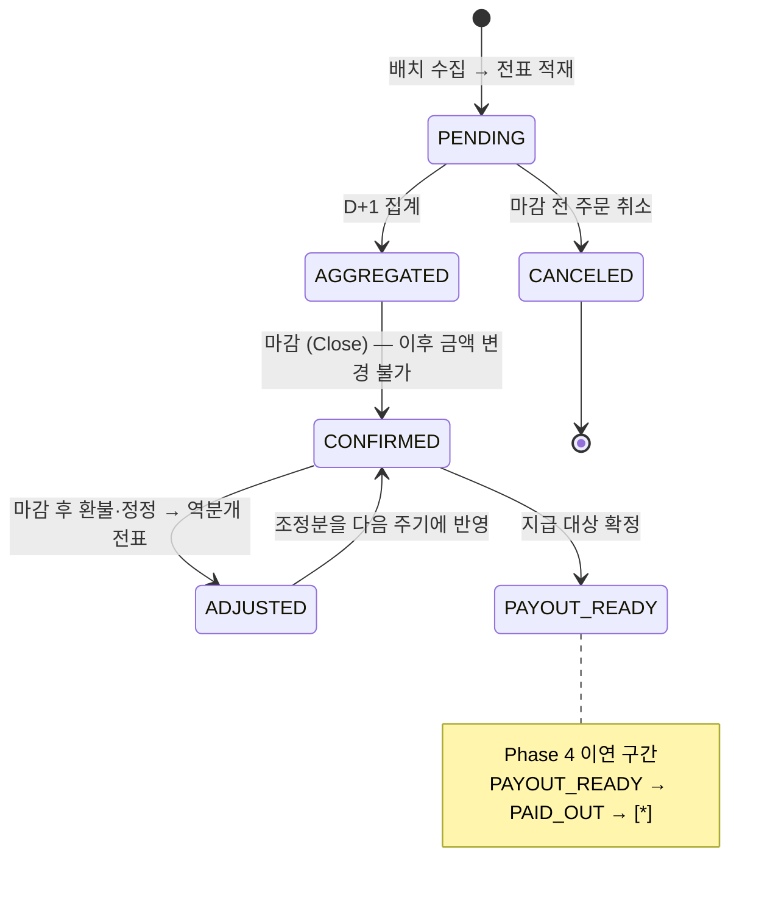
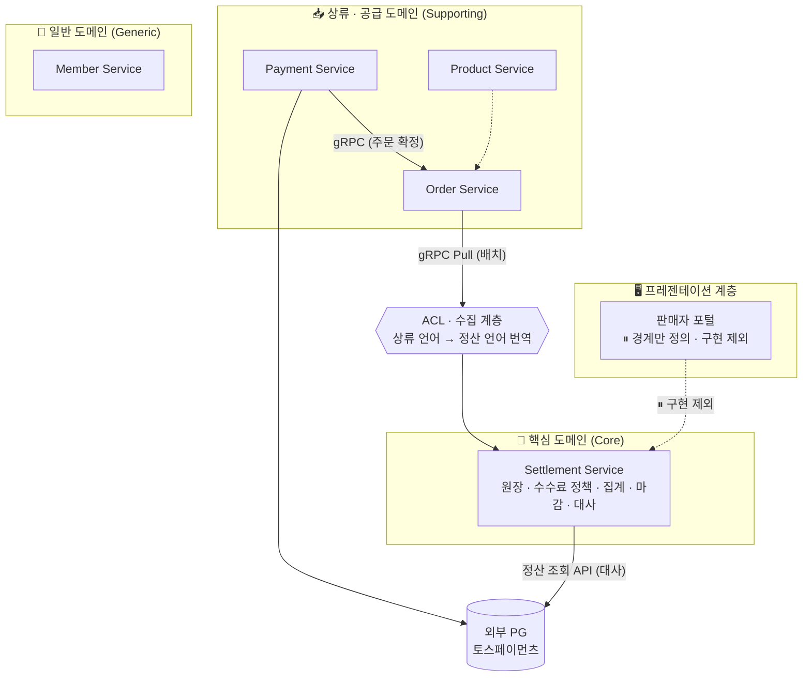
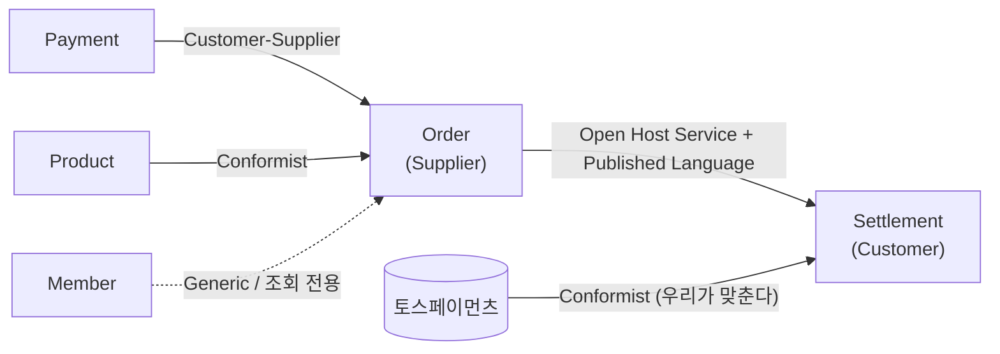
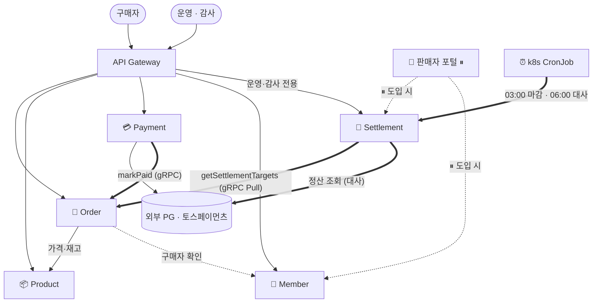

# 전략적 설계 — Bounded Context와 서비스 경계

> 정산(Settlement)을 핵심 도메인으로 놓고 **경계를 어디에 긋는가**를 다룹니다.
> 경계 안에서 **무엇을 어떻게 만드는가**는 [전술적 설계](tactical-design.md)에 있습니다.

| 항목 | 내용 |
|---|---|
| 서비스 구성 | **5개** — Settlement · Order · Payment · Product · Member ([ADR-020](adr/0020-서비스-5개-payout-제외.md)) |
| 서비스 간 통신 | **내부 gRPC · 외부 REST** ([ADR-023](adr/0023-내부-grpc-외부-rest-proto-소유.md)) · 메시지 브로커 없음 ([ADR-024](adr/0024-kafka-전면-제거.md)) |
| 정산 데이터 수집 | **배치 gRPC Pull** ([ADR-017](adr/0017-배치-grpc-pull-수집.md)) |
| 이번 범위 | 수집 → 계산 → 집계·마감 → **매출 대사** ([ADR-025](adr/0025-대사-범위-편입.md)) |

---

## 1. 설계 원칙

경계를 가르는 기준입니다. 모든 ADR은 이 중 하나 이상에 근거합니다.

| # | 기준 | 정산 도메인에서의 의미 |
|---|---|---|
| ① | **변경 이유 (SRP)** | 수수료율·정산주기·지급수단은 서로 다른 이유로 바뀐다. 함께 바뀌지 않는 것은 함께 두지 않는다 |
| ② | **데이터 소유권** | 정산 금액의 원본은 정산이 소유한다. 상류 데이터는 복제본이며 읽기 전용이다 |
| ③ | **트랜잭션 경계** | 원장 적재와 금액 계산은 한 트랜잭션이어야 한다. 지급은 아니어도 된다 |
| ④ | **부하·확장 축** | 정산은 야간 대량 배치, 주문·결제는 주간 실시간. 자원 경쟁이 다르다 |
| ⑤ | **장애 격리** | 외부 의존(PG, 지급 대행사)이 내부 원장을 물고 넘어지면 안 된다 |
| ⑥ | **감사 가능성** | 돈을 다루므로 "왜 이 금액인가"를 언제든 재현할 수 있어야 한다. **다른 기준과 충돌하면 이 기준이 이긴다** |

### 왜 "주문 기준" 과제인데 정산이 중심인가

과제는 *"주문 도메인을 기준으로"* 경계를 설계하라고 요구합니다. 이 문서는 그것을 **"주문 도메인을 출발점으로 삼아 경계를 도출하라"**로 해석합니다. 주문 도메인을 열어본 결과가 **"주문은 정산의 입력 원천이다"**였고(근거: [2.1](as-is-and-migration.md#11-이-시스템은-이미-정산-시스템이다)), 따라서 경계의 중심축을 정산으로 잡았습니다.

---

---

## 2. 정산 도메인 분석

### 2.1 유비쿼터스 언어

| 용어 | 정의 | 소유 | 현행 대응 |
|---|---|---|---|
| **정산 거래(Settlement Transaction)** | 정산 대상이 되는 개별 사건. 판매·환불·조정 | Settlement | 없음 (`Order` 행으로 대용) |
| **전표(Entry)** | 거래를 구성하는 금액 항목 한 줄. append-only | Settlement | 없음 |
| **정산 원장(Ledger)** | 전표의 집합. 정산의 **단일 진실 원천** | Settlement | 없음 |
| **총액(Gross)** | 구매자가 지불한 금액 | Order → Settlement 복제 | `Order.grossAmount` |
| **수수료(Fee)** | 플랫폼이 차감하는 금액 | Settlement | `Order.feeAmount` (외부 입력 ⚠️) |
| **환불(Refund)** | 판매 취소로 차감되는 금액 | Settlement | `Order.refundAmount` (단일 필드 ⚠️) |
| **정산 금액(Net)** | 전표 합계 (`SALE + FEE + REFUND + ADJUSTMENT`) | Settlement | `Order.netAmount` (매 수정마다 재계산 ⚠️) |
| **정산 주기(Cycle)** | 집계 단위 기간. **이번 설계에서는 D+1 고정** | Settlement | 없음 |
| **마감(Close)** | 특정 주기의 정산을 확정. **이후 금액 변경 불가** | Settlement | 없음 ⚠️ |
| **조정(Adjustment)** | 마감 후 오류·환불을 보정하는 **역분개 전표** | Settlement | 없음 |
| **수수료 정책(Fee Policy)** | 판매자·기간별 수수료율 규칙 | Settlement (D6) | 없음 |
| **지급(Payout)** | 확정 금액을 판매자 계좌로 송금 | Payout | 없음 — Phase 4 |

### 2.2 정산 거래의 생애주기

이번 범위(D8 = 범위 A)에 해당하는 상태만 표시하고, 지급 단계는 이연 구간으로 구분했습니다.



> 현행은 이 전체를 `settled: Boolean` 하나로 표현합니다. **정산 도메인의 핵심 책임은 이 상태 전이의 소유권**이며, 이것이 경계 설정의 출발점입니다.

> **불변식(I1~I7)은 [전술적 설계](tactical-design.md#2-불변식과-보장-수단)로 옮겼습니다.** 불변식은 *"무엇을 지키는가"*가 아니라 *"어떤 Aggregate가 어떻게 지키는가"*와 함께 읽어야 하기 때문입니다.

## 3. 서비스 경계 설계

### 3.1 도메인 분류 (Context Map)



> **Payout이 사라졌습니다.** [ADR-020](adr/0020-서비스-5개-payout-제외.md)에서 서비스 목록에서 제외하고 정산을 단일 서비스로 통합했습니다. 지급은 범위 B입니다.
>
> **Kafka 노드도 사라졌습니다.** [ADR-024](adr/0024-kafka-전면-제거.md)에 따라 서비스 간 통신은 모두 동기(gRPC/REST) 또는 배치 Pull입니다.
>
> **Settlement → 외부 PG 간선이 새로 생겼습니다.** [ADR-025](adr/0025-대사-범위-편입.md)의 대사가 토스 정산 조회 API를 호출합니다. **내부 서비스 의존이 아니라 외부 시스템 조회**이므로 서비스 간 결합은 늘지 않습니다.

| 분류 | 서비스 | 성격 | 이번 범위 |
|---|---|---|---|
| **Core** | Settlement | 사업의 차별점. 정확성·감사 가능성 최우선 | ✅ **초점** |
| Supporting | Order | 정산의 유일한 입력원 | ✅ |
| Supporting | Payment | 외부 PG 연동 | ✅ |
| Supporting | Product | 상품·재고 | ✅ |
| Generic | Member | 회원 신원 (신원만 · B4) | ✅ (최소 구성) |
| 프레젠테이션 | 판매자 포털 | 판매자 대면 화면·조합 (B1) | ⏸ **구현 제외** (ADR-013) |

> **판매자 포털은 도메인 서비스가 아닙니다.** 자체 데이터를 소유하지 않고 다른 서비스의 응답을 조합할 뿐이므로, Core/Supporting/Generic 어디에도 넣지 않고 별도 계층으로 표시했습니다.
>
> **Q1 결정에 따라 이번 범위에서는 만들지 않습니다.** 그래도 경계를 그려두는 이유는, **B1의 분리 효과가 포털 없이도 이미 달성되기 때문**입니다 — Settlement은 `sellerId`에만 답하고 "그가 누구인지·권한이 있는지"를 모릅니다. 나중에 최소 BFF로 붙이면 Settlement을 수정할 필요가 없습니다.

### 3.2 서비스별 책임과 데이터

#### 🧾 Settlement Service — 핵심 도메인

- **한 줄 책임**: 거래를 **정산 원장에 기록하고 판매자 지급액을 확정**한다
- **하지 않는 일**: 거래 발생, 결제 승인, 실제 송금(범위 B)

| 영역 | 책임 |
|---|---|
| 수집 (ACL) | Order의 정산 대상 조회 API(gRPC)를 **배치로 당겨와** 정산 거래로 번역, 멱등 적재 ([ADR-017](adr/0017-배치-grpc-pull-수집.md)) |
| 계산 | 배치 시점에 계산하되 **거래 발생일의 정책**을 적용, 전표 생성 ([ADR-018](adr/0018-배치시점-계산-거래일-정책.md)) |
| 정책 | 수수료 정책(`fee_policy`)과 정산 정책 소유 (D6) |
| 집계·마감 | D+1 주기 집계, 마감 시 금액 불변화 |
| 조정 | 마감 후 환불·정정을 역분개 전표로 반영 (D5) · 승인 절차 없음 (B3) |
| 조회 | 정산 현황 **내부 API 제공**. 판매자 대면은 판매자 포털이 담당 (B1) |
| **대사** | PG 정산 내역과 원장을 대조해 불일치 4종 탐지 ([ADR-025](adr/0025-대사-범위-편입.md)) |

**소유 데이터**: `settlement_transaction`, `settlement_entry`, `settlement_summary`, `fee_policy`, `settlement_cycle`, `reconciliation_result`
*(Spring Batch 메타 테이블은 B2 결정에 따라 별도 배치 DB — [5.3](tactical-design.md#33-서비스별-저장소))*

**주요 API** — 모두 **내부 API**입니다. 판매자에게 직접 노출하지 않습니다 (B1). Q1 결정으로 포털을 만들지 않으므로, **이번 범위의 소비자는 운영·감사와 스케줄러뿐**입니다.

| Method | Path | 설명 | 이번 범위 소비자 | 포털 도입 시 |
|---|---|---|---|---|
| `GET` | `/api/settlements/sellers/{sellerId}` | 판매자 정산 현황 (**마감 후 확정분만**) | 운영 | + 포털 |
| `GET` | `/api/settlements/cycles/{cycleDate}` | 주기별 정산 결과 | 운영 | + 포털 |
| `GET` | `/api/settlements/transactions/{txId}/entries` | 전표 상세 (감사용 · 기준 ⑥) | 운영 · 감사 | — |
| `POST` | `/api/settlements/cycles/{cycleDate}/close` | 정산 마감 배치 실행 | 스케줄러 · 운영 | — |
| `POST` | `/api/settlements/adjustments` | 조정 전표 발행 | 운영 (**역할 인가** · Q4) | — |

> **포털이 없어도 B1의 경계 효과는 달성됩니다.** Settlement은 `sellerId`에 대한 정산 데이터만 답할 뿐, **그가 누구인지·권한이 있는지를 모릅니다.** 인증·권한 확인·화면 조합이 애초에 이 서비스에 없으므로, 나중에 포털을 붙일 때 Settlement을 수정할 필요가 없습니다 (기준 ①).
>
> ⚠️ 뒤집어 말하면 **이 API에는 소유권 검증이 없습니다.** 외부에 직접 노출하면 타 판매자의 정산액이 조회되므로, 포털이 생기기 전까지 **내부망·운영 전용**으로 제한합니다.

#### 💸 Payout — 서비스로 두지 않습니다

[ADR-020](adr/0020-서비스-5개-payout-제외.md)에서 Payout을 서비스 목록에서 제외했습니다. 지급은 **범위 B**이며, 착수 시점에 Settlement에서 떼어낼지 다시 판단합니다.

| 항목 | 내용 |
|---|---|
| 지급 대상 계좌 | **지급 대행사가 보유** ([ADR-016](adr/0016-정산계좌-대행사-보유.md)). 내부는 판매자 식별자만 전달 |
| 계약의 자리 | 마감 상태(`CONFIRMED`)와 전표 구조가 그대로 지급의 입력 계약이 됩니다 |
| 파급 | 지급이 없으므로 대사는 **매출 대사**까지입니다. 불변식 I6(지급 합계 = 확정 정산 합계)는 검증되지 않습니다 |

#### 🛒 Order Service

- **한 줄 책임**: 주문의 **상태 전이**를 소유하고 구매 플로우를 조율한다
- **하지 않는 일**: 재고 차감, PG 호출, **수수료·정산 금액 계산**
- **정산 관점의 역할**: 정산의 **유일한 입력원**. 정산 대상 조회 API(gRPC)를 공개 — **Open Host Service**

**소유 데이터**: `order`, `order_item`, `order_status_history`
**이관 대상**: `feeAmount`, `refundAmount`, `netAmount`, `settled`, `settlementBatchId` → Settlement ([5.1](tactical-design.md#31-현행-order-테이블의-컬럼-이관))

| Method | Path | 설명 |
|---|---|---|
| `POST` | `/api/orders` | 주문 생성 (금액은 서버가 Product 조회로 계산) |
| `GET` | `/api/orders/{orderNo}` | 주문 조회 |
| `POST` | `/api/orders/{orderNo}/cancel` | 주문 취소 |

#### 💳 Payment Service

- **한 줄 책임**: 외부 PG 연동과 **결제 승인 사실**을 소유한다
- **하지 않는 일**: 주문 상태 변경(이벤트로 알릴 뿐), 재고 조작, 정산 금액 계산
- **분리 근거**: 유일한 외부 시스템 의존 (기준 ⑤) + PG 스펙 변경이라는 고유 변경 이유 (기준 ①)

**소유 데이터**: `payment`, `payment_failure`
**개선 사항**: `Payment.orderId` → **`Order.orderNo` 참조로 규약화** (현행 ⑦ 결함)

#### 📦 Product Service

- **한 줄 책임**: 상품 정보와 **재고 가용성**을 소유한다
- **하지 않는 일**: 주문 상태 판단, 금액 정산
- **재고를 함께 두는 이유**: "살 수 있는가"에 함께 답하는 데이터로 강한 정합성이 필요 (기준 ③). 패키지를 `product/` `inventory/`로 선분리해 재분리 여지 확보

**소유 데이터**: `product`, `stock`, `stock_reservation`
**개선 사항**: 현행 `/api/resources` 경로 → `/api/products`로 정정

#### 👤 Member Service

- **한 줄 책임**: 회원 신원을 소유한다
- **이번 범위**: 최소 구성 — 구매자·판매자 **신원만**. **정산 계좌는 다루지 않습니다** (B4)
- **필요 이유**: 현행에서 `buyerId` / `sellerId`가 UUID로만 떠 있어 실체가 없음
- **소비자**: Order(구매자 확인), 판매자 포털(판매자 인증)

**소유 데이터**: `member`

> B4 결정으로 `seller_account`를 **설계에서 제외**했고, Q5에서 **정산 계좌를 지급 대행사가 보유**하기로 확정됐습니다 (ADR-016). 따라서 Member는 Phase 4 이후에도 계좌를 갖지 않으며, **끝까지 신원 확인만 담당하는 최소 서비스로 남습니다.**

> **판매자 정산 정책(수수료율·주기)은 Member가 아니라 Settlement이 소유합니다.** (D6 결정 — *"정산 정책도 정산이라는 카테고리에 들어가기 때문"*)

---

## 4. 데이터 소유권 규칙

| # | 규칙 | 근거 |
|---|---|---|
| R1 | **정산 금액의 원본은 Settlement이 소유한다.** 상류는 정산 금액을 보유하지 않는다 | 현행 ①②③ 결함 해소 |
| R2 | 정산은 상류 DB를 **직접 조회하지 않는다** | 현행 ④ 결함 해소 / 체크포인트 2번 |
| R3 | 상류 데이터의 복제본은 **읽기 전용**이며, 전표 적재 시점의 **스냅샷으로 고정**한다 | 불변식 I7 |
| R4 | Settlement은 어떤 상류 서비스도 **호출하지 않는다** (하류 리프) | 순환 의존 차단 |
| R5 | 상류는 Settlement의 **존재를 모른다** | 단방향 의존 |

---

## 5. Bounded Context 관계 패턴

경계를 긋는 것만으로는 부족합니다. **경계 사이의 관계 유형**이 결합도를 결정합니다.



| 관계 | 패턴 | 왜 이 패턴인가 |
|---|---|---|
| **Order → Settlement** | **Open Host Service + Published Language** | Order가 `order_settlement.proto`를 **소유·공개**하고 Settlement이 가져다 씁니다. 공용 `common-proto`(Shared Kernel)를 쓰면 모든 서비스가 한 모듈에 묶이므로 배제했습니다 ([ADR-023](adr/0023-내부-grpc-외부-rest-proto-소유.md)) |
| **Settlement 내부 경계** | **ACL (Anticorruption Layer)** | proto를 직접 참조하더라도 **정산 도메인 모델이 Order의 언어를 그대로 쓰지 않습니다.** `inbound/translator`에서 주문 언어 → 정산 언어로 번역합니다 |
| **Payment → Order** | **Customer-Supplier** | Payment(하류)가 주문 확정을 요구하고 Order(상류)가 그 계약을 제공합니다. 양쪽 다 내부라 협상이 가능한 관계입니다 ([ADR-022](adr/0022-payment-order-호출-보정배치.md)) |
| **Product → Order** | **Conformist** | Order가 상품 모델을 그대로 받아들입니다. 번역할 만큼의 의미 차이가 없습니다 |
| **토스페이먼츠 → Settlement** | **Conformist** | 외부 PG의 응답 스키마를 **우리가 맞춥니다.** 협상 여지가 없습니다. 대신 `reconciliation` 계층에서 우리 원장 언어로 번역합니다 ([ADR-025](adr/0025-대사-범위-편입.md)) |

### ACL이 하는 번역 — 구체적으로

| 상류 언어 (Order) | 정산 언어 (Settlement) |
|---|---|
| `Order.status = PAID` | `SettlementTransaction.txType = SALE` |
| `Order.totalAmount` | `SettlementEntry(SALE, +amount)` |
| `Order.orderNo` | `sourceEventId` (멱등 키) + `orderNo` (추적용) |
| `Order.paidAt` | `cycleDate` (D+1 산출) · 수수료 정책 조회 기준 시점 |
| (없음) | `SettlementEntry(FEE, -amount)` — **정산이 만들어내는 개념** |

> **마지막 행이 ACL의 존재 이유입니다.** 수수료는 주문에 없는 개념입니다. 정산이 자기 언어로 **새로 만들어내는 것**이므로, 주문 모델을 그대로 가져다 쓰면 표현할 수 없습니다.

### 외부 PG와의 관계 — Conformist의 대가

대사([ADR-025](adr/0025-대사-범위-편입.md))는 토스 `GET /v1/settlements` 응답에 맞춰야 합니다. 여기서 **도메인 충돌**이 하나 드러납니다.

```
우리 언어 :  cycleDate  = 거래 발생일 기준 D+1 고정
PG 언어   :  soldDate   = 상점 정산 주기에 따라 가변
```

같은 거래를 **서로 다른 주기 개념으로 부릅니다.** Conformist이므로 우리가 맞춰야 하고, 그 비용이 `±3일 확장 매칭`과 `CYCLE_MISMATCH` 유형입니다. **경계 설계가 구현 비용으로 직결되는 사례입니다.**

---

## 6. 서비스 간 의존 관계

### 6.1 의존 관계도



**실선(→) = 동기 REST / 굵은선(⇒) = gRPC · 배치 / 점선 = 이연**

> **간선이 줄었습니다.** 기존 도식은 Kafka 노드 하나에 이벤트 6종이 오갔습니다. 지금은 **gRPC 호출 2개 + 배치 트리거 1개**입니다.

### 6.2 의존 규칙과 근거

| 관계 | 방식 | 근거 |
|---|---|---|
| Order → Product | **동기 REST** | 주문 접수 시점에 가격·재고 가용성을 즉시 알아야 함. 실패하면 주문이 성립 불가 |
| Order → Payment | **의존 없음** | 결제는 클라이언트가 PG와 직접 수행. Order가 PG 장애에 물리지 않음 |
| **Payment → Order** | **동기 gRPC** | 결제 승인 후 주문을 확정시킴. 프론트 이탈에 강함 ([ADR-022](adr/0022-payment-order-호출-보정배치.md)) |
| **Settlement → Order** | **배치 gRPC Pull** | **현행 최대 결합의 해소점.** 정산은 주문 DB를 읽지 않음 (R2) ([ADR-017](adr/0017-배치-grpc-pull-수집.md)) |
| Order → Settlement | **없음** | 주문은 정산의 존재를 모름 (R5) |
| **Settlement → 외부 PG** | **동기 REST (배치)** | 대사용 정산 내역 조회. **내부 서비스 의존이 아님** ([ADR-025](adr/0025-대사-범위-편입.md)) |
| 판매자 포털 → Settlement · Member | **동기 조회** ⏸ | 포털 도입 시에만 ([ADR-013](adr/0013-판매자-포털-구현-제외.md)) |
| Settlement → 판매자 포털 | **없음** | 핵심 도메인이 프레젠테이션 계층을 알지 않음 (기준 ①) |
| * → Member | **동기 조회** | 조회 전용. 장애 시 캐시·기본값으로 degrade |

### 6.3 경계 규칙

| 규칙 | 내용 | 상태 |
|---|---|---|
| **R1** | 각 서비스는 자기 데이터만 소유하고, 남의 테이블을 읽지 않는다 | 🟢 유지 |
| **R2** | **상류 DB에 직접 접근하지 않는다** | 🟢 유지 |
| **R3** | 서비스 간 데이터는 공개 계약(proto)으로만 오간다 | 🟢 유지 |
| **R4** | ~~정산은 어떤 상류 서비스도 호출하지 않는다~~<br/>→ **정산은 상류의 공개 API(gRPC)로만 조회하며, 상류 DB에 직접 접근하지 않는다** | 🟡 **개정** ([ADR-017](adr/0017-배치-grpc-pull-수집.md)) |
| **R5** | 상류는 정산의 존재를 모른다 | 🟢 유지 |

> **R4 개정이 이번 재설계에서 잃은 것입니다.** 기존 설계는 *"정산은 아무도 호출하지 않는 하류 리프"*를 강점으로 내세웠습니다. 배치 Pull을 택하면서 `Settlement → Order` 간선이 생겼습니다.
>
> **다만 R2는 그대로입니다.** 잃은 것은 *"호출하지 않는다"*이지 *"남의 DB를 읽지 않는다"*가 아닙니다. 현행의 진짜 문제였던 **DB 레벨 결합은 해소됩니다.**

### 6.4 순환 의존이 없음을 확인

```
  구매자 ──▶ Gateway ──▶ Order ──▶ Product
                 │          ▲
                 ├──▶ Payment ══╯   markPaid
                 │          │
                 │          ▼
                 │       [외부 PG]
                 │
                 └──▶ Settlement ══▶ Order       배치 Pull · 읽기 전용
                             ╚══════▶ [외부 PG]   대사 · 읽기 전용

  ── 동기 REST      ══ gRPC · 배치      [외부] 내부 서비스 아님
```

- **Settlement → Order는 읽기 전용 조회**입니다. Order는 Settlement을 호출하지 않으므로 순환이 생기지 않습니다
- **Payment → Order는 단방향**입니다. Order는 Payment를 호출하지 않습니다
- 외부 PG는 내부 서비스가 아니므로 사이클 판정 대상이 아닙니다
- **결과: 사이클 없음.** 모든 간선이 한 방향으로 흐릅니다

