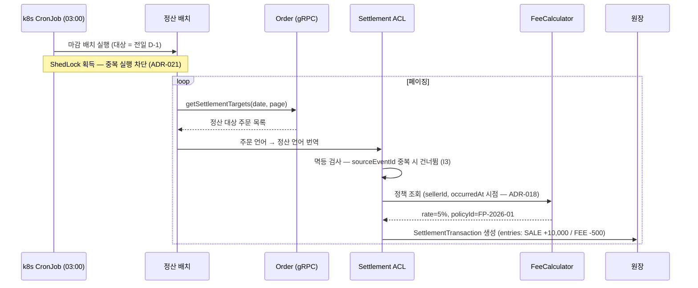
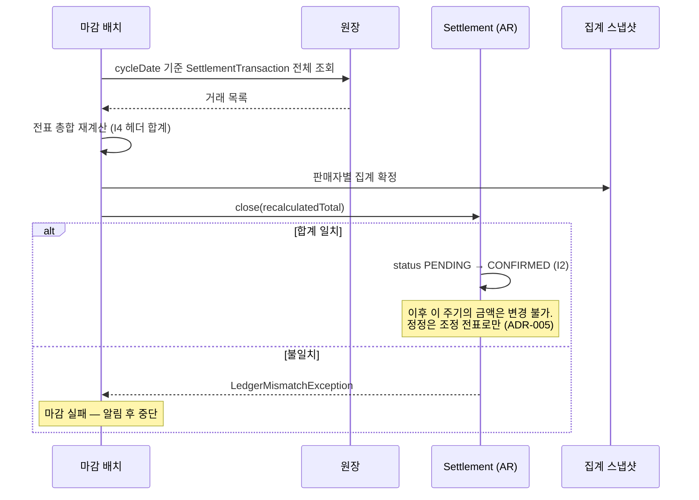
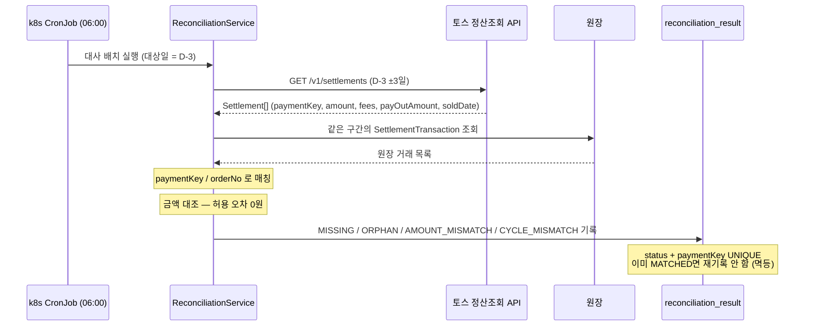

# 전술적 설계 — Aggregate와 원장

> 경계 **안에서** 무엇을 어떻게 만드는가를 다룹니다.
> 경계를 **어디에 긋는가**는 [전략적 설계](strategic-design.md)에 있습니다.

| 항목 | 내용 |
|---|---|
| Aggregate | **2개** — `Settlement` / `SettlementTransaction` ([ADR-019](adr/0019-정산-aggregate-2개-분리.md)) |
| 원장 기록 | **전표식** — 1거래 = N개 항목 ([ADR-004](adr/0004-전표식-원장.md)) |
| 수집 | 배치 gRPC Pull ([ADR-017](adr/0017-배치-grpc-pull-수집.md)) · 매일 03:00 ([ADR-021](adr/0021-k8s-cronjob-shedlock.md)) |
| 대사 | 매일 06:00 · D-3 대상 · ±3일 매칭 ([ADR-025](adr/0025-대사-범위-편입.md)) |

---

## 1. Aggregate 설계

### 1.1 경계

```
Settlement (AR)                      SettlementTransaction (AR)
 ├─ SettlementId (VO)                 ├─ TxId (VO)
 │   └─ sellerId + cycleDate          ├─ settlementId ──────────┐ ID로만 참조
 ├─ status: PENDING → CONFIRMED       ├─ orderNo                │ (객체 참조 금지)
 ├─ netAmount: Money (VO)             ├─ txType: SALE | REFUND | ADJUSTMENT
 └─ closedAt                          ├─ sourceEventId  ← UNIQUE (I3)
                                      ├─ occurredAt
                                      └─ entries: List<SettlementEntry>  ← 내부 Entity
                                           ├─ EntryType: SALE | FEE | ADJUSTMENT
                                           ├─ amount: Money (VO)
                                           └─ feePolicyId  (I5)
```

**왜 둘인가.** 불변식마다 성립하는 단위가 다르기 때문입니다.

| 불변식 | 성립 단위 | 그래서 어느 Aggregate |
|---|---|---|
| **I2** 마감 불변 | 판매자 × 주기 | `Settlement` |
| **I4** 합계 일치 | 주문 1건 | `SettlementTransaction` |
| **I3** 멱등 | 주문 1건 | `SettlementTransaction` |

> 하나로 합치면(판매자 하루 거래 전부를 한 Aggregate에) I2·I4를 모두 트랜잭션으로 지킬 수 있지만, **거래가 수천 건일 때 로딩이 무너집니다.** 둘로 나눈 대가는 헤더 합계의 결과적 일관성이고, 그 대가는 마감 시 재계산으로 닫습니다.

### 1.2 Value Object

| VO | 구성 | 왜 VO인가 |
|---|---|---|
| **`Money`** | `amount: BigDecimal` + `currency` | 금액 연산을 한곳에 모읍니다. **절사·반올림 규칙이 여기 있어야** [ADR-025](adr/0025-대사-범위-편입.md)의 0원 오차가 성립합니다 |
| **`SettlementId`** | `sellerId` + `cycleDate` | 두 값이 항상 함께 다닙니다. 따로 떼면 *"어느 판매자의 언제 주기"*가 깨집니다 |
| **`TxId`** | UUID | 식별자 타입 안정성 |
| **`CycleDate`** | `LocalDate` + D+1 산출 규칙 | 주기 계산 규칙을 도메인 안에 둡니다 |

> **`Money`가 이 설계에서 가장 중요한 VO입니다.** 수수료 절사 규칙이 PG와 어긋나면 대사가 전건 불일치로 터지는데, 그 규칙이 흩어져 있으면 맞출 수가 없습니다.

### 1.3 Aggregate가 강제하는 것

```java
// Settlement — I2를 코드로 강제
public void close(Money recalculatedTotal) {
    if (this.status == CONFIRMED)
        throw new AlreadyClosedException(id);        // I2: 마감 후 재마감 금지
    if (!this.netAmount.equals(recalculatedTotal))
        throw new LedgerMismatchException(id, netAmount, recalculatedTotal);
                                                     // I4: 불일치면 마감 실패
    this.status = CONFIRMED;
    this.closedAt = now();
}

// SettlementTransaction — I4(주문 단위)를 코드로 강제
public Money net() {
    return entries.stream()                          // 합계를 별도 저장하지 않음
                  .map(SettlementEntry::amount)
                  .reduce(Money.ZERO, Money::add);
}
```

> **`net()`이 계산 결과를 저장하지 않는 것이 핵심입니다.** 저장하는 순간 전표와 어긋날 수 있고, I4가 *"지켜지길 바라는 것"*으로 내려앉습니다.

### 1.4 응용 계층의 책임

Aggregate 밖으로 나온 것들입니다. **누가 책임지는지 명시하지 않으면 아무도 안 지킵니다.**

| 책임 | 담당 | 내용 |
|---|---|---|
| 전표 적재 → 헤더 갱신 순서 | `SettlementAppendService` | 두 Aggregate에 걸친 순서 보장 |
| 마감 순서 | `SettlementCloseService` | 적재 완료 확인 → 총합 재계산 → `close()` 호출 |
| 재계산 | `SettlementCloseService` | 전표 총합을 구해 `close()`에 전달 |
| 중복 실행 차단 | ShedLock | Aggregate 밖 — 인프라 레벨 ([ADR-021](adr/0021-k8s-cronjob-shedlock.md)) |

### 1.5 도메인 서비스 vs 응용 서비스

| 구분 | 예 | 판단 근거 |
|---|---|---|
| **도메인 서비스** | `FeeCalculator` | 수수료 계산은 **도메인 규칙**이고, 어느 한 Aggregate에 넣기 어색합니다 (정책과 거래에 걸침) |
| **도메인 서비스** | `ReversalEntryFactory` | 역분개 전표 생성 규칙 ([ADR-005](adr/0005-역분개-전표.md)) |
| **응용 서비스** | `SettlementCloseService` | 트랜잭션 경계·순서 조율. 도메인 규칙이 아님 |
| **응용 서비스** | `ReconciliationService` | 외부 API 호출과 대조 — **도메인 규칙이 아니라 검증 절차** |

---

## 2. 불변식과 보장 수단

**설계 검증 기준입니다.** 모든 구현은 아래를 만족해야 합니다.

| # | 불변식 | 현행 | 이번 설계에서의 보장 수단 |
|---|---|---|---|
| I1 | 원장은 **추가만 가능(append-only)**, 사후 수정 불가 | ❌ | 전표식 모델([ADR-004](adr/0004-전표식-원장.md)) + UPDATE 금지 |
| I2 | **마감된 주기의 금액은 변경 불가.** 변경은 조정 전표로만 | ❌ | **`Settlement.close()`가 Aggregate 안에서 강제** ([ADR-019](adr/0019-정산-aggregate-2개-분리.md)) + 역분개 |
| I3 | 같은 거래는 원장에 **두 번 들어가지 않는다** | ⚠️ | `SettlementTransaction.sourceEventId` UNIQUE + ShedLock ([ADR-021](adr/0021-k8s-cronjob-shedlock.md)) |
| I4 | `net` = 해당 거래의 **전표 합계**와 항상 일치 | ⚠️ | **주기별 상이** — 아래 표 참조 |
| I5 | 정산 금액은 **계산 근거(적용 수수료율·시점)를 재현** 가능 | ❌ | 전표에 `feePolicyId` 기록 + 거래일 기준 정책 ([ADR-018](adr/0018-배치시점-계산-거래일-정책.md)) |
| I6 | 지급 금액 합계 = 확정 정산 금액 합계 | — | **범위 B** — 지급이 없어 검증 불가 ([ADR-020](adr/0020-서비스-5개-payout-제외.md)) |
| I7 | 정산 결과는 **상류 데이터가 바뀌어도 불변** | ❌ | 적재 시점 스냅샷 복제 + 거래일 기준 정책 |

---

### I4는 두 층으로 나뉩니다

[ADR-019](adr/0019-정산-aggregate-2개-분리.md)에서 Aggregate를 둘로 나누면서, I4의 보장 수준이 층마다 달라졌습니다.

| 층 | 불변식 | 보장 수단 | 강도 |
|---|---|---|---|
| **주문 단위** | `entries` 합 = `SettlementTransaction.net` | `SettlementTransaction` Aggregate **내부** | 🟢 **트랜잭션 강제** |
| **헤더 합계** | 전표 총합 = `Settlement.netAmount` | 마감 시 `close()`에서 재계산·검증 | 🟡 **결과적 일관성** |

> **이것이 [ADR-019](adr/0019-정산-aggregate-2개-분리.md)에서 의도적으로 포기한 부분입니다.** 배치 진행 중에는 `netAmount`와 전표 총합이 어긋나는 구간이 존재합니다.
>
> **마감이 그 구간을 닫습니다.** `close()`는 전표 총합을 재계산해 `netAmount`에 확정한 뒤 `CONFIRMED`로 전이하고, **불일치하면 마감을 실패시킵니다.** 어긋남이 마감 시점에 반드시 해소되거나, 아니면 마감이 안 됩니다.

### 대사가 검증하는 불변식

[ADR-025](adr/0025-대사-범위-편입.md)의 대사는 **내부 불변식이 아니라 외부 정합성**을 봅니다.

| 대사 유형 | 실질적으로 검증하는 것 |
|---|---|
| `MISSING` | **수집 완전성** — 상류에서 정산으로 빠짐없이 넘어왔는가 |
| `ORPHAN` | 과다 계상 — 취소가 반영됐는가 |
| `AMOUNT_MISMATCH` | **I5의 실질 검증** — 우리가 계산한 수수료가 PG와 같은가 |
| `CYCLE_MISMATCH` | 주기 개념 차이 (오류 아님 · 관측용) |

---

## 3. 정산 원장 스키마

### 3.1 현행 `order` 테이블의 컬럼 이관

| 현행 컬럼 | 이관 대상 | 사유 |
|---|---|---|
| `fee_amount` | → `settlement_entry` (FEE 전표) | 수수료 정책은 Settlement 소유 (R1) |
| `refund_amount` | → `settlement_entry` (REFUND 전표) | 부분환불 이력을 전표로 보존 |
| `net_amount` | → **저장하지 않음. 전표 합계로 산출** | 불변식 I4 — **`@PreUpdate` 자동 재계산 제거** |
| `settled` | → `settlement_transaction.status` | boolean → 상태 enum으로 확장 |
| `settlement_batch_id` | → `settlement_cycle` 연결 | 정산 진행 상태는 Settlement 관심사 |
| `gross_amount` | Order 유지 + Settlement **스냅샷 복제** | 주문서 금액이자 정산 기준 금액 (R3) |
| `paid_at` | Order 유지 + Settlement **스냅샷 복제** | 주문 상태 전이 시각이자 정산 기준일 |
| `status` | Order 유지 (`String` → `OrderStatus` enum) | 상태 전이를 타입으로 강제 |

> `Order.markSettled()` 메서드는 **삭제**하고 정산 원장의 상태 전이로 대체합니다.

### 3.2 정산 원장 스키마 (D4 = 전표식)

#### `settlement_transaction` — 정산 거래 헤더

| 컬럼 | 타입 | 설명 |
|---|---|---|
| `tx_id` | UUID | PK |
| `tx_type` | enum | `SALE` / `REFUND` / `ADJUSTMENT` |
| `ref_tx_id` | UUID | 원거래 참조 (REFUND·ADJUSTMENT일 때) |
| `order_no` | varchar | 상류 주문 참조 키 (스냅샷) |
| `seller_id` | UUID | 정산 대상 판매자 |
| `cycle_date` | date | 귀속 정산 주기 (D+1) |
| `occurred_at` | timestamp | 거래 발생 시각 (스냅샷) |
| `status` | enum | `PENDING` / `AGGREGATED` / `CONFIRMED` / `ADJUSTED` / `CANCELED` |
| `source_event_id` | varchar | **멱등키 · UNIQUE** (불변식 I3) |

#### `settlement_entry` — 전표 항목 (append-only)

| 컬럼 | 타입 | 설명 |
|---|---|---|
| `entry_id` | UUID | PK |
| `tx_id` | UUID | 소속 거래 |
| `entry_type` | enum | `SALE` / `FEE` / `VAT` / `REFUND` / `FEE_RETURN` / `ADJUSTMENT` |
| `amount` | numeric(15,2) | **부호 있는 금액** (차감은 음수) |
| `fee_policy_id` | UUID | 적용된 수수료 정책 (불변식 I5) |
| `issued_by` | varchar | 발행 주체. 자동 적재는 `SYSTEM`, 수기 조정은 운영자 식별자 |
| `created_at` | timestamp | 기록 시각 |

> **UPDATE·DELETE를 금지합니다.** 정정이 필요하면 상쇄 전표를 추가합니다 (D5).
>
> **`issued_by`를 둔 이유**: B3 결정으로 조정 전표에 승인 절차를 두지 않으므로, 발행 즉시 원장에 반영됩니다. Q4에서 **운영자 역할(Role) 기반 인가**로 호출 자격을 제한하기로 했고(ADR-015), `issued_by`가 그 위에 **"권한 있는 누가 언제 발행했는가"**를 남깁니다 (기준 ⑥). 역할 검증을 Gateway에서 할지 Settlement에서 할지는 [Q7](README.md#남은-확인-항목)로 열려 있습니다.

**기록 예시** — 10,000원 판매, 수수료율 5%

```
settlement_transaction
| tx_id | tx_type | order_no | seller_id | cycle_date | status    |
| tx-01 | SALE    | ORD-001  | S-100     | 2026-01-16 | CONFIRMED |

settlement_entry
| entry_id | tx_id | entry_type | amount   | fee_policy_id |
| e-01     | tx-01 | SALE       | +10,000  | -             |
| e-02     | tx-01 | FEE        |    -500  | FP-2026-01    |   ← 적용 정책이 박힘 (I5)
                              net = +9,500  (전표 합계 · I4)
```

#### `settlement_summary` — 집계 스냅샷 (읽기 모델)

조회할 때마다 전표를 전부 합산하지 않도록 읽기 모델을 둡니다. **마감 배치가 갱신하며, 마감 전에는 채워지지 않습니다** ([ADR-017](adr/0017-배치-grpc-pull-수집.md)).

| 컬럼 | 설명 |
|---|---|
| `seller_id`, `cycle_date` | 복합 PK |
| `gross_sum`, `fee_sum`, `refund_sum`, `adjustment_sum` | 전표 유형별 합계 |
| `net_amount` | 정산 예정 금액 |
| `status` | 주기 상태 |
| `updated_at` | 갱신 시각 |

> 전표 적재 시 **같은 트랜잭션에서 증분 갱신**합니다 (기준 ③). 원본은 어디까지나 전표이며, 스냅샷이 틀리면 전표에서 재생성합니다.

#### `fee_policy` — 수수료 정책 (D6: Settlement 소유)

| 컬럼 | 설명 |
|---|---|
| `policy_id` | PK |
| `seller_id` | null이면 전체 기본 정책 |
| `rate` | 수수료율 |
| `effective_from` / `effective_to` | 적용 기간 — **거래 시점 기준으로 조회** (D3) |

### 3.3 서비스별 저장소

**Database per Service.** 조인이 아니라 **API(gRPC)로** 데이터를 합칩니다.

| 서비스 | 스키마 | 포트 |
|---|---|---|
| gateway | — | 8080 |
| order-service | `order_db` | 8081 |
| product-service | `product_db` | 8082 |
| payment-service | `payment_db` | 8083 |
| **settlement-service** | `settlement_db` | 8084 |
| member-service | `member_db` | 8085 |
| 판매자 포털 ⏸ | 자체 저장소 없음 | — (구현 제외 · ADR-013) |
| **배치 메타 (B2·Q3)** | `settlement_batch_db` | — (DB만, 서비스 전용) |

### 3.4 Spring Batch 메타 테이블 분리 (B2)

B2 결정에 따라 `BATCH_JOB_INSTANCE` / `BATCH_JOB_EXECUTION` / `BATCH_STEP_EXECUTION` 등 메타 테이블을 `settlement_db`가 아닌 **`settlement_batch_db`로 분리**하고, Q3 결정에 따라 이 DB는 **정산 서비스 전용**입니다.

**분리하는 이유** — Q3 결정으로 근거가 바뀌었습니다.

| | 근거 | Q3 이후 |
|---|---|---|
| ~~중앙 모니터링~~ | 여러 서비스 배치를 한곳에서 운영 | ❌ **무효** — 서비스별로 두므로 해당 없음 |
| 관심사 분리 | 배치 실행 이력은 **운영 데이터이지 정산 데이터가 아님**. 백업·보존 주기를 다르게 가져갈 수 있음 | ✅ 유효 |
| 승격 여지 | 나중에 전사 공용으로 통합할 때 접속 정보만 변경 | ✅ 유효 |

> ⚠️ **근거가 "관심사 분리"뿐이라면, 같은 DB의 별도 스키마로도 같은 목적을 달성하면서 아래 트랜잭션 문제를 피할 수 있습니다.** Phase 2 착수 전 한 번 검토할 가치가 있습니다 → [Q6](README.md#남은-확인-항목)

**⚠️ 대가로 잃는 것 — 트랜잭션 경계**

Spring Batch의 기본 구성은 메타 테이블과 비즈니스 데이터가 **같은 DataSource**에 있을 때, 청크 커밋과 `StepExecution` 갱신을 **한 트랜잭션**으로 묶습니다. DB를 분리하면 이 보장이 사라집니다.

```
[같은 DB]   청크 커밋 + StepExecution 갱신  →  한 트랜잭션 (원자적)
[분리 후]   청크 커밋(settlement_db)  ─┐
                                      ├─ 서로 다른 트랜잭션
            StepExecution 갱신(settlement_batch_db) ─┘
```

따라서 **청크는 커밋됐는데 StepExecution 갱신 전에 장애**가 나면, 재시작 시 해당 청크가 **재처리**될 수 있습니다.

**이 설계에서 감당 가능한 이유** — 정산 경로가 이미 멱등하게 설계되어 있습니다.

| 경로 | 재처리 시 동작 | 근거 |
|---|---|---|
| 전표 적재 | `source_event_id` UNIQUE 제약으로 **중복 삽입 차단** | 불변식 I3 |
| 마감 상태 갱신 | `PENDING → CONFIRMED` 재적용은 결과가 동일 | 멱등 전이 |
| 집계 스냅샷 | 전표에서 재생성 가능 | 원본은 전표 (I4) |

> 즉 **배치 DB 분리가 안전해서가 아니라, 원장이 멱등해서 감당되는 구조**입니다. 이 전제가 깨지면(예: 비멱등 배치 스텝 추가) 위험이 되살아나므로 [R-04](README.md#미해소-리스크)로 등록합니다.

**구성**: `@BatchDataSource`로 `settlement_batch_db` DataSource를 지정하고, 청크 트랜잭션은 `settlement_db`의 `PlatformTransactionManager`를 명시적으로 사용합니다 ([9.4](tactical-design.md#64-설정-예시)).

---

---

## 4. 핵심 시나리오

### 4.1 판매 거래의 정산 반영 — 수집 → 계산



> **`occurredAt` 시점으로 정책을 조회하는 것이 [ADR-018](adr/0018-배치시점-계산-거래일-정책.md)의 핵심입니다.** 배치가 며칠 뒤에 재실행돼도 **같은 금액이 나옵니다.**

### 4.2 정산 마감 — 집계·마감



> **`close()`가 재계산 값을 받는 이유**: 두 Aggregate에 걸친 I4를 **마감 시점에 반드시 해소**하기 위해서입니다. 어긋나 있으면 마감이 안 됩니다 ([ADR-019](adr/0019-정산-aggregate-2개-분리.md)).
>
> **`SettlementConfirmed` 이벤트 발행이 사라졌습니다.** Kafka를 쓰지 않고([ADR-024](adr/0024-kafka-전면-제거.md)) Payout도 범위 밖이므로([ADR-020](adr/0020-서비스-5개-payout-제외.md)) 구독자가 없습니다.

### 4.3 마감 후 환불 — 역분개

> **정산 설계의 수준을 가장 잘 드러내는 시나리오입니다.**

```
1/15  판매 10,000원 발생 → SALE +10,000 / FEE -500 전표 적재
1/16  1/15 주기 마감 (CONFIRMED, net 9,500원)
1/20  구매자가 환불 요청 → 10,000원 환불 발생
      ⚠️ 이미 마감된 주기의 거래다.
```

**처리 — 원장을 수정하지 않고 조정 전표를 추가합니다.**

```
settlement_transaction
| tx_id | tx_type    | ref_tx_id | cycle_date | status    |
| tx-01 | SALE       | -         | 2026-01-16 | CONFIRMED |   ← 그대로. 건드리지 않음
| tx-99 | ADJUSTMENT | tx-01     | 2026-01-21 | PENDING   |   ← 1/20자 조정 거래

settlement_entry
| e-01 | tx-01 | SALE       | +10,000 |   ← 불변
| e-02 | tx-01 | FEE        |    -500 |   ← 불변
| e-98 | tx-99 | REFUND     | -10,000 |   ← 조정 전표
| e-99 | tx-99 | FEE_RETURN |    +500 |   ← 수수료 환입
```

| 결과 | 설명 |
|---|---|
| 1/16 주기 | **9,500원으로 영구 확정.** 이미 고지한 정산서가 바뀌지 않음 (I2·I7) |
| 1/21 주기 | 조정분 **-9,500원**이 반영되어 차감 |
| 감사 추적 | "언제 무엇을 왜 조정했는가"가 전표로 남음 (기준 ⑥) |

> **현행 방식과의 대비**: 현행은 `Order` 행의 `refundAmount`를 갱신하고 `@PreUpdate`가 `netAmount`를 재계산합니다. **이미 정산이 끝난 1/16 주기의 금액이 소급해서 바뀌며**, 지급액과 원장이 불일치합니다.

### 4.4 정산 현황 조회 — 마감 후 확정분만

**[ADR-017](adr/0017-배치-grpc-pull-수집.md)에서 실시간 조회 요구를 철회했습니다.** 배치 수집이면 마감 전 데이터가 원장에 없으므로, 조회는 **확정된 주기**에 대해서만 성립합니다.

```
GET /api/settlements/sellers/{sellerId}?cycleDate=2026-01-15

{
  "sellerId": "S-100",
  "cycleDate": "2026-01-15",
  "status": "CONFIRMED",        ← 마감된 주기만 조회 가능
  "grossSum": 150000,
  "feeSum": -7500,
  "refundSum": -10000,
  "netAmount": 132500,
  "closedAt": "2026-01-16T03:12:04Z"
}
```

| 주기 상태 | 응답 |
|---|---|
| `CONFIRMED` | 확정 금액 반환 |
| `PENDING` (마감 전) | **금액을 반환하지 않음** — `202` 또는 빈 결과. 원장에 데이터가 없습니다 |

> **무엇을 잃었는가**: 마감 전 "예상 정산액"을 보여줄 수 없습니다. 판매자 입장에서는 거래 당일에 정산 예정액을 확인할 수 없고, **다음 날 마감 후에야** 볼 수 있습니다.
>
> **왜 수용하는가**: 실무 정산이 실제로 그렇게 동작합니다. *"확정 금액은 마감 후에만 존재한다"*는 것이 정산 도메인의 성질이고, 예상 금액이 필요하면 **원장이 아니라 별도 계산 경로**로 내야 합니다. 그 경로는 API를 늘리므로 이번 범위에서 만들지 않습니다.
>
> ⚠️ **이 API는 `sellerId` 소유 검증을 하지 않습니다.** 호출자가 그 판매자 본인인지 확인하는 책임은 포털에 있으므로([ADR-009](adr/0009-판매자-포털-경계.md)), **내부망·운영 전용으로만 열고 외부에 노출하지 않습니다.**

---

## 5. 대사 설계

[ADR-025](adr/0025-대사-범위-편입.md)의 구현 형태입니다.

### 5.1 흐름



### 5.2 매칭 규칙

| 단계 | 규칙 |
|---|---|
| 1. 키 매칭 | `paymentKey` 우선, 없으면 `orderNo` |
| 2. 구간 | 대상일 **D-3**, 조회 폭 **±3일** |
| 3. 금액 대조 | `amount` ↔ SALE 전표 · `fees[].fee` ↔ FEE 전표 · `payOutAmount` ↔ `tx.net()` |
| 4. 날짜 대조 | `soldDate` ↔ `cycleDate` — **다르면 `CYCLE_MISMATCH`, 불일치로 세지 않음** |
| 5. 허용 오차 | **0원** — 단, 절사 규칙이 PG와 같아야 성립 |

> **4번이 없으면 주기만 다른 정상 건이 `MISSING` + `ORPHAN` 한 쌍으로 이중 계상됩니다.**

### 5.3 스키마

```sql
CREATE TABLE reconciliation_result (
    id                BIGSERIAL PRIMARY KEY,
    type              VARCHAR(20)  NOT NULL,   -- MISSING | ORPHAN | AMOUNT_MISMATCH | CYCLE_MISMATCH
    order_no          VARCHAR(64),
    payment_key       VARCHAR(200) NOT NULL,
    ledger_amount     NUMERIC(19,4),
    pg_amount         NUMERIC(19,4),
    diff              NUMERIC(19,4),
    ledger_cycle_date DATE,
    pg_sold_date      DATE,
    status            VARCHAR(20)  NOT NULL,   -- DETECTED | MATCHED | RESOLVED
    detected_at       TIMESTAMPTZ  NOT NULL,

    CONSTRAINT uq_recon_payment UNIQUE (payment_key, status)
);
```

> **`UNIQUE (payment_key, status)`가 멱등성의 핵심입니다.** ±3일 확장 조회는 **같은 거래를 여러 날 배치가 중복으로 집습니다.** 이미 `MATCHED`인 건을 재기록하지 않아야 대사 배치가 여러 번 돌아도 안전합니다.

### 5.4 탐지 후 — 자동으로 고치지 않습니다

```
대사 배치 → 불일치 탐지 → reconciliation_result 기록 → [사람이 확인]
                                                          ↓
                                         조정 전표 발행 (역할 인가 · ADR-015)
                                                          ↓
                                              역분개 전표 적재 (ADR-005)
```

- 원장은 여전히 **append-only**(I1) — 대사가 I1을 깨지 않습니다
- 자동 정정을 넣지 않은 이유는 **잘못된 대사 로직이 원장을 오염시키기 때문**입니다
- **PG 절사 규칙 확인 전까지는 알람을 끄고 관측만 합니다** ([ADR-025](adr/0025-대사-범위-편입.md))

---

## 6. 소스 구조

### 6.1 모듈 의존 규칙

| 규칙 | 의도 |
|---|---|
| `services/*` 는 **서로를 컴파일 의존하지 않는다** | 경계 위반을 **컴파일 에러**로 차단 — 현행 ④ 결함의 구조적 예방 |
| `settlement-service`는 상류 엔티티를 **import하지 않는다** | `import com.example.order.domain.Order` 가 **불가능**해야 함 |
| 서비스 간 호출은 `client/` 패키지에만 존재 | 외부 의존 지점을 한곳에 모아 추적·대체 가능 |
| **proto는 공용 모듈에 두지 않는다** | 제공자가 소유하고 소비자가 참조 — Shared Kernel 회피 ([ADR-023](adr/0023-내부-grpc-외부-rest-proto-소유.md)) |
| `common-grpc` 에는 **인프라 설정만** 둔다 | 공유 모듈이 새로운 결합점이 되는 것을 방지 |

### 6.2 전체 모듈 구성

```
demo/
├── settings.gradle
├── docs/1week/README.md
│
├── services/
│   ├── settlement-service/     ← 🧾 핵심 · 이번 주차 초점
│   ├── order-service/          ← 🛒 정산의 유일한 입력원
│   ├── payment-service/        ← 💳 외부 PG 연동
│   ├── product-service/        ← 📦 상품 + 재고
│   ├── member-service/         ← 👤 최소 구성 (신원만)
│   └── seller-portal/          ← 🏪 ⏸ 구현 제외 (ADR-013)
│                                  도입 시 최소 BFF. Settlement 수정 불필요
│
├── gateway/                    // Spring Cloud Gateway
└── common/
    ├── common-core/            // ErrorResponse, GlobalExceptionHandler, SwaggerConfig
    └── common-grpc/            // gRPC 공통 설정 (인터셉터·에러 변환)
                                //   ⚠️ proto는 여기 두지 않습니다 — 제공자 소유 (ADR-023)
```

> **이번 주차에 실제로 만드는 모듈은 5개**입니다 ([ADR-020](adr/0020-서비스-5개-payout-제외.md)). `seller-portal`은 **경계만 표시**해둔 자리이며, 디렉터리를 미리 만들어둘 필요도 없습니다. **Payout은 서비스 목록에서 아예 제외했습니다.**

### 6.3 Settlement Service 내부 구조

```
settlement-service/src/main/java/com/example/settlement/
├── SettlementApplication.java
│
├── inbound/                            ← ACL · 상류 언어 → 정산 언어 번역
│   ├── client/                         OrderSettlementGrpcClient   // ADR-017
│   ├── translator/                     SettlementTransactionTranslator
│   └── dto/                            상류 응답 페이로드 (읽기 전용)
│
├── ledger/                             ← 정산 원장 · 핵심 중의 핵심
│   ├── domain/                         Settlement (AR), SettlementTransaction (AR),
│   │                                   SettlementEntry, Money (VO), SettlementId (VO),
│   │                                   EntryType, TransactionStatus
│   ├── repository/                     SettlementRepository,
│   │                                   SettlementTransactionRepository
│   └── service/                        SettlementAppendService     // append-only 보장
│
├── fee/                                ← 수수료 정책 (Settlement 소유)
│   ├── domain/                         FeePolicy
│   ├── repository/
│   └── service/                        FeeCalculator               // 거래일 기준 조회 (ADR-018)
│
├── cycle/                              ← 집계 · 마감
│   ├── domain/                         SettlementCycle, SettlementSummary
│   ├── batch/                          SettlementCloseJobConfig,
│   │                                   OrderPullStep,              // gRPC Pull (ADR-017)
│   │                                   AggregationStep,
│   │                                   CloseStep                   // 재계산 + close()
│   └── service/                        SettlementCloseService      // 마감 = 불변화
│
├── reconciliation/                     ← 대사 (ADR-025)
│   ├── domain/                         ReconciliationResult, MismatchType
│   ├── client/                         TossSettlementClient        // GET /v1/settlements
│   ├── batch/                          ReconciliationJobConfig     // 06:00 · D-3 · ±3일
│   └── service/                        ReconciliationService       // 매칭 + 대조
│
├── adjustment/                         ← 조정 전표
│   └── service/                        AdjustmentEntryService      // 역분개 발행 (ADR-005)
│
└── api/
    ├── controller/                     SettlementController,
    │                                   SettlementBatchController
    └── dto/
```

> ⚠️ **`inbound/client/`가 생겼습니다.** 기존 설계는 *"Settlement은 어떤 상류 서비스도 호출하지 않는 하류 리프"*(규칙 R4)라며 `client/` 패키지가 없다는 점을 강조했습니다. **배치 Pull을 택하면서 이 특성을 잃었습니다** ([ADR-017](adr/0017-배치-grpc-pull-수집.md)).
>
> **다만 현행과의 결정적 차이는 유지됩니다.** 현행 `SettlementBatchConfig`는 `OrderRepository`를 **직접 주입받아 남의 테이블을 읽습니다.** 개정 후에는 **공개 gRPC 계약으로만** 조회하며, 응답은 `translator`에서 정산 언어로 번역됩니다. 잃은 것은 *"호출하지 않는다"*이고, 지킨 것은 *"남의 DB를 읽지 않는다"*(R2)입니다.
>
> **`outbound/publisher/`가 사라졌습니다.** `SettlementConfirmed`를 발행할 구독자가 없습니다 ([ADR-024](adr/0024-kafka-전면-제거.md) · [ADR-020](adr/0020-서비스-5개-payout-제외.md)).

### 6.4 설정 예시

```yaml
# settlement-service/src/main/resources/application.yaml
spring:
  application:
    name: settlement-service

  # 비즈니스 DB — 원장·정책·집계
  datasource:
    url: jdbc:postgresql://${DB_HOST:localhost}:${DB_PORT:5432}/${DB_NAME:settlement_db}

  batch:
    jdbc:
      initialize-schema: always

# 배치 메타 DB — B2 결정에 따라 분리
batch:
  datasource:
    url: jdbc:postgresql://${BATCH_DB_HOST:localhost}:${BATCH_DB_PORT:5432}/${BATCH_DB_NAME:settlement_batch_db}

server:
  port: 8084

# gRPC 클라이언트 — 상류 조회 (ADR-017 · ADR-023)
grpc:
  client:
    order-service:
      address: ${ORDER_GRPC:static://localhost:9090}
      negotiation-type: plaintext

# 대사 — 토스페이먼츠 정산 조회 (ADR-025)
reconciliation:
  target-offset-days: 3          # 대사 대상일 = D-3
  match-window-days: 3           # 조회 폭 ±3일
  amount-tolerance: 0            # 허용 오차 0원 — 절사 규칙이 PG와 같아야 성립
  alert-enabled: false           # PG 절사 규칙 확인 전까지 관측만

# 스케줄은 애플리케이션 밖 — k8s CronJob (ADR-021)
#   정산 마감  03:00  ·  대사  06:00
```

```java
// DataSource 두 개를 명시적으로 분리한다 (B2)
@Bean
@BatchDataSource                                   // JobRepository 전용
@ConfigurationProperties("batch.datasource")
DataSource batchDataSource() { ... }

@Bean
@Primary                                           // 원장·집계 쓰기 전용
@ConfigurationProperties("spring.datasource")
DataSource settlementDataSource() { ... }
```

> ⚠️ **청크 스텝은 `settlementDataSource`의 트랜잭션 매니저를 명시적으로 지정해야 합니다.** 지정하지 않으면 청크 트랜잭션이 배치 DB에 걸려 원장 쓰기가 트랜잭션 밖에서 일어납니다. 현행 `SettlementBatchConfig`가 `StepBuilder.transactionManager(transactionManager)`로 주입받는 부분이 **정확히 이 지점**이며, DB 분리 후에는 어느 매니저인지가 중요해집니다. → [5.4](tactical-design.md#34-spring-batch-메타-테이블-분리-b2)

---

