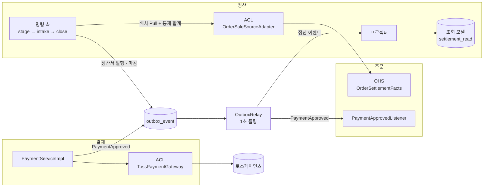

# demo — 정산 도메인에 CQRS · Event-Driven Architecture · ACL 적용

> **핵심 원칙 — 돈의 경로는 당겨서 검증하고, 파생 데이터만 밀어낸다.**
>
> 판매자에게 줄 돈을 기록하는 원장은 지금처럼 배치로 당겨 와서 통제 합계로 검증합니다.
> 조회 화면이나 주문 상태처럼 늦거나 틀려도 다시 만들 수 있는 데이터만 이벤트로 흘립니다.
> 세 패턴은 이 원칙을 코드로 옮기는 도구입니다.

| 패턴 | 적용 위치 | 해결한 문제 | 핵심 결정 |
|---|---|---|---|
| **CQRS** | 정산 조회 | 조회마다 원장을 집계하면 느리고, 수집·마감 배치와 같은 테이블에서 경합한다 | 원장과 분리된 조회 모델(`settlement_read`)을 이벤트로만 갱신한다 |
| **EDA** | 결제 → 주문, 마감 → 조회 모델 | 결제가 주문을 직접 부르는 결합, 상태 저장과 이벤트 전송이 따로 커밋되는 이중 쓰기, 보이지 않는 유실 | 트랜잭셔널 아웃박스 + 같은 JVM 안의 릴레이. Kafka 는 쓰지 않는다 |
| **ACL** | 토스 → 결제, 주문 → 정산 | 외부·상류의 모델이 도메인 안으로 퍼진다 | 포트는 우리 언어로 정의하고, 번역은 경계의 순수 클래스가 맡는다 |

---

## 전체 구조



| 흐름 | 방식 | 이유 |
|---|---|---|
| 결제 승인 → 주문 확정 | 이벤트 `PaymentApproved` | 주문 상태는 늦게 반영돼도 재시도로 결국 맞춰진다 |
| 주문 → 정산 원장 | 배치 Pull + 통제 합계 | 원장은 "빠뜨린 것이 없다"를 증명해야 한다 |
| 정산 마감 → 판매자 조회 | 이벤트 → 조회 모델 | 조회 모델은 원장에서 다시 만들 수 있는 파생 데이터다 |

---

## 1. CQRS — 정산 조회를 원장에서 떼어 낸다

**설계 의도.** 원장은 전표·분개로 정규화한 쓰기 모델입니다. 판매자가 보려는 "정산일별 지급액"과 "누적 지급 대상액"은 분개를 계정 × 정산일로 합산해야 나옵니다. 조회할 때마다 이렇게 집계하면 비용이 원장 크기에 비례하고, 배치가 쓰는 테이블과 경합합니다.

한편 확정 정산서는 마감 뒤 바뀌지 않습니다. 그래서 조회 모델이 잠깐 늦어도 틀린 값을 보여 주는 게 아니라 "아직 없음"을 보여 줄 뿐입니다. 이 성질 덕분에 CQRS 의 대가인 최종적 일관성을 감당할 수 있습니다.

| 구분 | 명령 (Command) | 조회 (Query) |
|---|---|---|
| 모델 | `JournalEntry` · `SettlementDay` · `SellerStatement` | `StatementView` · `SellerSummaryView` · `SettlementDayView` |
| 저장소 | `settlement` 스키마 | `settlement_read` 스키마 |
| 갱신 | 유스케이스 — 트랜잭션 경계는 `SettlementCommandFacade` | 이벤트 프로젝터 `SettlementReadModelProjector` |
| API | `POST /api/settlements/...` | `GET /api/settlements/...` |

**핵심 결정**

- 조회 모델은 정산이 공개한 이벤트(`SellerStatementIssued`, `SettlementDayClosed`)로**만** 갱신합니다. 입력이 이벤트뿐이라 조회 모델을 버리고 다시 만들 수 있습니다.
- 합계는 더하기(`+=`)로 쌓지 않고 **매번 다시 계산**합니다. 같은 이벤트가 두 번 오거나 순서가 바뀌어도 결과가 같습니다.
- 조회 측 코드(`settlement.query`)는 정산의 도메인·유스케이스를 import 하지 않습니다. 테스트가 이를 강제합니다.

**대가** — 마감이 커밋된 뒤 릴레이가 이벤트를 전달하기 전까지(기본 1초) 조회 API 는 그날을 모릅니다.

---

## 2. EDA — 트랜잭셔널 아웃박스로 이벤트를 흘린다

**설계 의도.** 1주차에는 결제가 주문을 직접 호출했습니다([ADR-022](docs/1week/adr/0022-payment-order-호출-보정배치.md)). 그래서 결제가 주문을 알아야 했고, 주문 쪽 장애 때 "결제 성공 / 주문 미확정"이 남아 보정 배치가 필요했습니다.

그런데 문제의 본질은 브로커가 없다는 데 있지 않았습니다. 진짜 문제는 두 가지였습니다.
- **이중 쓰기**: 상태 저장과 이벤트 전송이 따로 커밋되어 한쪽만 남을 수 있습니다.
- **보이지 않는 유실**: 이벤트가 사라져도 아무도 모릅니다.

트랜잭셔널 아웃박스는 브로커 없이 둘 다 해결합니다.

```
[비즈니스 트랜잭션]  상태 저장  +  outbox_event 기록        ← 같이 커밋되거나 같이 롤백
        │ commit
        ▼
[OutboxRelay — 1초마다, 이벤트 1건 = 트랜잭션 1개]
   꺼내기(FOR UPDATE SKIP LOCKED) → 리스너 호출 → 발행 표시
   실패하면 롤백 → 1초 → 2초 → … 최대 10분 간격으로 재시도
   10번 실패하면 dead 로 남김 (GET /internal/outbox/stats 로 보임)
```

| 이벤트 | 발행 (같은 트랜잭션) | 소비 | 중복 전달 대비 |
|---|---|---|---|
| `PaymentApproved` | 결제 승인 저장 | 주문 — `paidAt` 을 PG 승인 시각으로 확정 | `processed_event` 기록 + 도메인 멱등 |
| `SellerStatementIssued` | 정산 마감 | 조회 모델 | upsert + 재계산 |
| `SettlementDayClosed` | 정산 마감 | 조회 모델 | upsert + 재계산 |

**핵심 결정**

- 이벤트 기록은 비즈니스 트랜잭션 **안에서만** 할 수 있습니다(`Propagation.MANDATORY`). 밖에서 부르면 바로 실패합니다.
- 전달은 "적어도 한 번"입니다. 같은 이벤트가 두 번 올 수 있으므로 소비자는 모두 **멱등**하게 만들었습니다.
- 재시도해도 결과가 같은 실패(금액 불일치, 주문 없음)는 예외 대신 결과값으로 알립니다. 릴레이가 헛되이 재시도하지 않게 하기 위해서입니다.
- PG 승인 호출(외부 HTTP)은 트랜잭션 **밖**에서 합니다. 결제 저장과 이벤트 기록만 한 트랜잭션으로 묶습니다.
- **원장 입력(정산 수집)은 이벤트로 바꾸지 않았습니다.** "못 받은 것이 없다"를 증명할 수 있는 쪽은 통제 합계를 대조하는 배치입니다([ADR-017](docs/1week/adr/0017-배치-grpc-pull-수집.md)).
- 서비스를 나눌 때는 발행 코드를 그대로 두고 `EventDispatcher` 구현만 바꿉니다(브로커 또는 폴링 API).

**대가** — 결제 응답 시점에 주문은 아직 확정 전일 수 있습니다. 또 실패한 이벤트를 건너뛰고 다음 것을 보내므로, 실패 이후의 순서는 보장하지 않습니다.

---

## 3. ACL — 경계에서 번역한다

**설계 의도.** 상대의 모델이 도메인 안으로 퍼지면, 상대가 바뀔 때 도메인까지 고쳐야 합니다. 1주차에 PG 와의 관계를 Conformist(상대 모델을 받아들임)로 정했습니다. 하지만 상대 모델을 받아들이는 것과 도메인 곳곳에 퍼뜨리는 것은 다릅니다.

그래서 두 경계 모두 **포트는 우리 언어로 정의하고, 번역은 경계의 어댑터에서** 합니다. 번역 규칙은 스프링 없는 순수 클래스(`*Translator`)라 단위 테스트로 고정했습니다.

| 경계 | 우리 쪽 포트 | ACL (번역) | 번역 규칙 |
|---|---|---|---|
| 토스 → 결제 | `PaymentGateway` | `TossPaymentGateway` + `TossPaymentTranslator` | `DONE` 만 승인 · 한글 결제수단 8종 → `PaymentMethod`(모르면 `UNKNOWN`) · `approvedAt` 의 오프셋 보존 → `Instant` · 요청과 다른 주문번호·금액은 거부 |
| 주문 → 정산 | `SaleSourcePort` | `OrderSaleSourceAdapter` + `OrderFactTranslator` | 판매자 UUID → 문자열 · `BigDecimal` → 원 단위 `Money`(`10000.50` 은 거부) · KST `LocalDateTime` → `Instant` |

**핵심 결정**

- 주문은 엔티티·리포지토리 대신 **공개 API(Open Host Service, `order.published`)** 만 내놓습니다. 이 API 는 목록과 통제 합계를 **서로 다른 쿼리**로 만듭니다. 목록을 세어 합계를 만들면 목록에 생긴 누락이 합계에도 그대로 생겨, 대조해도 잡지 못하기 때문입니다.
- 번역할 수 없는 값은 **조용히 버리지 않고 실패**시킵니다. 한 건을 빼면 통제 합계가 어긋나 어차피 마감이 막히므로, 원인을 먼저 드러내는 편이 낫습니다.
- 포트 덕분에 가짜 PG(`fake-pg` 프로파일)로 토스 키 없이 전체 흐름을 시연할 수 있습니다. 서비스를 나누면 `OrderSaleSourceAdapter` 내부만 gRPC 호출로 바뀝니다.

**대가** — 계층과 타입이 늘어납니다. 같은 사실이 응답 DTO → 값 객체 → 이벤트로 세 번 모양을 바꿉니다.

---

## 4. 1주차 결정과의 관계

| 1주차 | 2주차 | 이유 |
|---|---|---|
| [ADR-017](docs/1week/adr/0017-배치-grpc-pull-수집.md) 배치 Pull 수집 | **유지** — ACL 로 구현하고 통제 합계를 더함 | 원장 경로는 누락이 없음을 증명해야 한다 |
| [ADR-022](docs/1week/adr/0022-payment-order-호출-보정배치.md) 결제 → 주문 호출 + 보정 배치 | **개정** → ADR-028 | ADR-022 는 "브로커가 없으면 Choreography 는 불가능하다"를 전제로 했다. 아웃박스를 쓰면 브로커 없이도 가능하므로 전제가 성립하지 않는다 |
| [ADR-024](docs/1week/adr/0024-kafka-전면-제거.md) Kafka 전면 제거 | **유지** — 아웃박스만 재도입 | 유실이 테이블에 남아 보이므로 ADR-024 의 우려(조용한 유실)에 해당하지 않는다 |
| [ADR-025](docs/1week/adr/0025-대사-범위-편입.md) 대사 | **유지** (3주차) | 이벤트 지연·누락의 최종 안전망 |

결정 근거는 1주차와 같은 형식의 ADR 세 건에 남겼습니다.
- [ADR-027 CQRS](docs/2week/adr/0027-정산-조회-cqrs-조회-모델.md)
- [ADR-028 EDA](docs/2week/adr/0028-아웃박스-인프로세스-이벤트.md)
- [ADR-029 ACL](docs/2week/adr/0029-acl-pg-주문-번역.md)

---

## 5. 경계는 테스트가 지킨다

세 패턴의 핵심은 "누가 누구를 모르는가"입니다. 문서에만 있는 규칙은 코드에서 쉽게 무너집니다. 그래서 `DependencyRuleTest` 가 import 문을 검사해 규칙 7개를 강제합니다.

| 규칙 | 지키는 것 |
|---|---|
| 정산 도메인은 자바 표준과 자기 자신만 안다 | 헥사고날 |
| 정산 애플리케이션은 도메인·자기 포트·자기 공개 이벤트만 안다 | 헥사고날 |
| 조회 측은 쓰기 모델을 모르고 공개 이벤트만 안다 | CQRS |
| 정산에서 주문을 아는 곳은 `adapter.out.order` 하나뿐이고, 그마저 `order.published` 만 쓴다 | ACL |
| 토스의 타입은 토스 어댑터 패키지 밖으로 새지 않는다 | ACL |
| 결제는 주문을 모르고, 주문은 결제의 공개 이벤트만 안다 | EDA |
| 상류(주문·결제)는 하류(정산)를 모르고, 공통 모듈은 어떤 컨텍스트도 모른다 | 의존 방향 |

규칙을 일부러 깨뜨린 사본 세 개로도 돌려 봤습니다(조회 측에 도메인 import, 결제에 주문 import, 릴레이 백오프 제거). 세 경우 모두 해당 테스트가 실패했으므로, 테스트가 헛돌지 않는다는 것을 확인했습니다.

---

## 6. 검증 범위

| 확인한 것 | 결과 |
|---|---|
| 전체 소스 컴파일 (공식 시그니처를 따른 스텁 + Lombok 을 전개한 점검용 사본) | 메인 154개 클래스, 테스트 전부 오류 없음 |
| 스프링 없이 도는 테스트 | 10개 클래스 **43건 통과** |
| 변이 검사 | 일부러 깨뜨린 사본 3개를 모두 잡음 |
| 문서 링크 | 402개 정상 |

**미확인**

- 실제 jar 로 하는 Gradle 빌드
- 스프링 컨텍스트 기동
- PostgreSQL 에서의 SQL 동작
- Jackson 3 코덱 왕복
- 배치 Job 실행
- 토스 실결제

로컬 확인 순서는 [2주차 상세 문서](docs/2week/README.md)의 "검증 범위"에 있습니다.

## 7. 바뀐 동작

- **일일 정산 배치 엔드포인트**: `/api/batch/jobs/daily-settlement?businessDate=` 입니다. 예전 `batch` 패키지와 `/api/batch/jobs/settlement` 는 삭제했습니다.
- **결제의 `method` 저장값**: `"카드"` 대신 `"CARD"` 로 저장됩니다. 기존 데이터가 있으면 두 형식이 섞입니다.
- **배치 실행 이력**: DB 에 남지 않습니다(Spring Boot 4 배치 스타터의 기본 동작). 같은 날짜를 다시 돌려도 안전한 이유는 실행 이력이 아니라 유스케이스의 멱등성입니다.
- **`.env`**: DB 비밀번호가 들어 있으므로 저장소에 넣지 않습니다.

## 문서

| 문서 | 내용 |
|---|---|
| [docs/2week/README.md](docs/2week/README.md) | 2주차 상세 — 과제 대응 표, 실행 방법, 시나리오, 테스트 목록 |
| [docs/2week/adr/](docs/2week/adr) | ADR-027 ~ 029 — 패턴별 결정 기록 |
| [docs/2week/settlement-design.md](docs/2week/settlement-design.md) | 정산 도메인 설계 — 원장 · 통제 합계 · 마감 |
| [docs/1week/README.md](docs/1week/README.md) | 1주차 서비스 경계 설계와 ADR 001–026 |

**기술 스택** — Java 21 · Spring Boot 4.1.1 · Spring Batch 6 · Spring Data JPA + JdbcTemplate · PostgreSQL · Jackson 3
