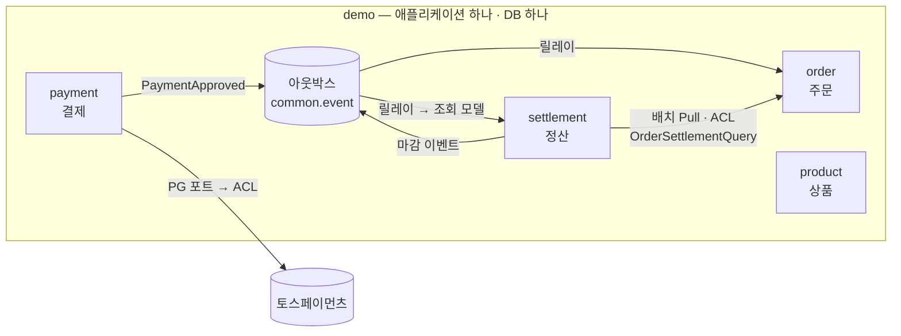

# demo — 커머스 정산 모놀리스

> 주문·결제·상품, 그리고 판매자에게 줄 돈을 계산하고 확정하는 **정산**을 담은 스프링 부트 애플리케이션입니다.
> 네 모듈 모두 **같은 헥사고날 구조**를 따르고, 모듈 사이는 **공개 포트와 이벤트로만** 연결됩니다.

## 1. 모듈 지도



| 모듈 | 하는 일 | 다른 모듈과의 연결 |
|---|---|---|
| `payment` | 토스 결제 승인, 실패 기록 | 토스를 ACL 뒤에 격리하고, 승인되면 `PaymentApproved` 를 발행 |
| `order` | 주문 생성·조회, 결제 승인 반영 | `PaymentApproved` 를 받아 스스로 확정. 정산에는 좁은 공개 포트 `OrderSettlementQuery` 만 제공 |
| `product` | 상품 CRUD | 없음 — 독립 모듈 |
| `settlement` | 원장 기록, 수집·마감, 판매자 조회 | 주문을 배치로 당겨 ACL 로 번역. 마감 결과를 이벤트로 조회 모델에 전달 |
| `common.event` | 트랜잭셔널 아웃박스와 릴레이 | 이벤트 전달 인프라 (공유 커널) |

## 2. 모든 모듈의 구조 — 헥사고날

```
<모듈>
├── domain              엔티티 · 값 객체 · 규칙 — 가장 안쪽
├── application
│   ├── port/in         유스케이스 인터페이스 (+ 입력·출력 DTO)
│   ├── port/out        밖에 필요한 기능의 인터페이스 — 저장소, PG, 상류 원천
│   └── service         유스케이스 구현
├── adapter
│   ├── in              web(컨트롤러) · event(리스너) · batch(Job)
│   └── out             persistence(JDBC) · pg(토스) · order(ACL) · event(아웃박스)
└── published           다른 모듈에 공개하는 이벤트 (Published Language)
```

| 규칙 | 의미 |
|---|---|
| 도메인은 아무것도 모른다 | `domain` 은 `application` · `adapter` 를 import 하지 않는다 |
| 애플리케이션은 어댑터를 모른다 | 기술은 전부 `port/out` 뒤에 숨는다 |
| 입구는 포트를 부른다 | 컨트롤러·리스너·Job 은 `service` 가 아니라 `port/in` 을 부른다 |
| 모듈은 공개된 것만 안다 | 다른 모듈의 `port/in`(공개 포트)과 `published`(이벤트)만 쓸 수 있다 |

모듈마다 순수함의 정도는 다릅니다.
- **정산**은 핵심 도메인이라 `domain` · `application` 이 스프링도 모르는 순수 자바입니다. 저장은 JDBC 어댑터가 포트를 구현합니다.
- **주문·결제·상품**은 지원 모듈이라 저장 포트가 Spring Data 리포지토리 인터페이스를 그대로 상속합니다(구현체는 Spring Data 가 만듭니다). 의존 방향은 똑같이 지키면서 코드를 줄이는 실용적 선택입니다.

## 3. 패턴 배치 — 문제가 있는 곳에만

원칙은 **돈의 경로는 당겨서 검증하고, 파생 데이터만 이벤트로 밀어낸다**입니다.

| 모듈 | CQRS | EDA | ACL | 이유 |
|---|:---:|:---:|:---:|---|
| `settlement` | ✅ | ✅ 발행 | ✅ 주문 → 정산 | 조회 부하, 다시 만들 수 있는 파생 데이터, 상류 모델 번역이 모두 실제 문제 |
| `payment` | — | ✅ 발행 | ✅ 토스 → 결제 | 외부 PG 모델을 격리하고, 주문을 직접 부르던 결합을 끊는다 |
| `order` | — | ✅ 소비 | 공개 포트 제공 | 결제 승인을 스스로 반영하고, 정산에는 필요한 면만 연다 |
| `product` | — | — | — | 주고받는 사실도, 외부 모델도, 복잡한 조회도 없다. 적용하면 받는 쪽 없는 이벤트, 원본과 같은 조회 모델 같은 비용만 생긴다 |

- **CQRS** — 판매자 조회는 원장을 집계하지 않고 별도 조회 모델(`settlement_read`)을 읽습니다. 조회 모델은 마감 이벤트로만 갱신되고, 합계를 매번 다시 계산해서 중복 전달이나 순서 뒤바뀜에도 결과가 같습니다.
- **EDA** — 상태 변경과 이벤트 기록을 한 트랜잭션으로 묶는 트랜잭셔널 아웃박스를 씁니다(Kafka 없음). 릴레이가 1초마다 전달하고, 실패하면 지수 백오프로 재시도하며, 10번 실패하면 dead 로 남깁니다. 소비자는 모두 멱등입니다.
- **ACL** — 포트는 우리 언어로 정의하고, 번역은 경계의 순수 클래스(`*Translator`)가 합니다. 번역할 수 없는 값은 조용히 버리지 않고 실패시킵니다.
- **정산 원장 입력은 이벤트가 아닙니다.** 배치가 당겨 와서 통제 합계("N건, X원")를 대조해야 빠뜨린 것이 없음을 증명할 수 있기 때문입니다.

## 4. 주요 흐름

| 흐름 | 경로 |
|---|---|
| 결제 승인 | `PaymentController` → `PaymentService` → PG 포트(토스 ACL) → 결제 저장 + `PaymentApproved` 기록(한 트랜잭션) → 릴레이 → `PaymentApprovedListener` → `Order.confirmPayment` |
| 일일 정산 | `settlement-intake` Job: **stage**(주문 공개 포트 → ACL → 스테이징) → **verify**(통제 합계 대조) → **post**(원장, 500건씩) → **mark** → `settlement-close` Job: 판매자별 정산서 발행 + 마감 이벤트 기록 |
| 정산 조회 | 릴레이 → `SettlementReadModelProjector` → `settlement_read` → `GET /api/settlements/...` |

## 5. 데이터

| 스키마 | 관리 | 내용 |
|---|---|---|
| `public` | JPA (`ddl-auto`) | 주문 · 결제 · 상품 |
| `public` | Flyway `V4` | 아웃박스 `outbox_event`, 멱등 소비 기록 `processed_event` |
| `settlement` | Flyway `V1~V3` | 원장(추가만 가능 — DB 트리거) · 마감 · 스테이징 · 수수료 정책 |
| `settlement_read` | Flyway `V4` | CQRS 조회 모델 |

## 6. 규칙은 테스트가 지킨다

- `architecture/DependencyRuleTest` (규칙 11개, import 기준): 헥사고날 규칙, 계층형 패키지(`presentation` · `infrastructure`) 재발 금지, CQRS · ACL · EDA 경계, 모듈 간 의존 방향
- `SettlementArchitectureTest` (ArchUnit, 바이트코드 기준): 같은 규칙의 핵심 5개

## 7. 실행

PostgreSQL 11 이상이 필요합니다. 접속 정보는 `DB_HOST` · `DB_PORT` · `DB_NAME` · `DB_USERNAME` · `DB_PASSWORD`(또는 `.env`)로 넣습니다.

```bash
./gradlew bootRun                                             # 토스 키: TOSS_SECRET_KEY
./gradlew bootRun --args='--spring.profiles.active=fake-pg'   # 토스 키 없이 가짜 PG 로
./gradlew test
```

| API | 용도 |
|---|---|
| `/api/orders` · `/api/payments` · `/api/resources` | 주문 · 결제 · 상품 |
| `POST /api/batch/jobs/settlement-intake` · `settlement-close` `?targetDate=` | 정산 수집 · 마감 (기본값: 어제) |
| `GET /api/settlements/sellers/{sellerId}/statements` · `/summary`, `GET /api/settlements/days/{date}` | 정산 조회 (CQRS 조회 측) |
| `POST /internal/settlement/refunds` · `/journals/{sourceKey}/reversal` | 환불 · 정정 전표 (운영자) |
| `GET /internal/outbox/stats` · `POST /internal/outbox/relay` | 아웃박스 현황 · 즉시 릴레이 |

## 8. 알려진 한계

- 결제와 주문을 잇는 `paymentKey` 가 정산 스테이징에 없습니다. 대사 단계에서 연결할 예정입니다.
- 환불 사실은 운영 API 로만 들어옵니다. 상류에서 수집하는 경로는 아직 없습니다.
- 배치 실행 이력이 DB 에 남지 않습니다(Spring Boot 4 배치 스타터 기본). 재실행이 안전한 이유는 이력이 아니라 멱등 키입니다.
- 환불이 있는 판매를 정정하면 환불분이 이중으로 빠집니다. 이를 막는 규칙은 아직 없습니다.

## 문서

- [docs/1week](docs/1week/README.md) — 서비스 경계 설계와 ADR 001–026
- [docs/3week](docs/3week/README.md) — 규칙 대장 · 깨기 기록
